# Linux 帳號管理與ACL權限設定
## 帳號與群組管理
### UID & GID
UID: user ID  
GID: group ID  
每當linux創建一個user，則至少會獲得這兩個ID讓linux去認你是誰和你屬於哪個goup  
當我們顯示檔案屬性時，linux會根據"/etc/passwd"和"/etc/group"來顯示對應的帳號和群組  

下面我們查看一下自己的id，並且修改一下"/etc/passwd"裡面這個user的UID  
會發現當我們改完之後linux無法正確的顯示user是誰  
\* 記得一定要改回來  
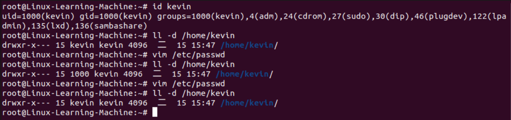  

### 使用者帳號
當我們進行linux的帳號登入時，會進行以下步驟:  
1. 去"/etc/passwd"裡面查看使否有此帳號，若有則將其UID和GID (GID存放在"/etc/group") 讀出，  
   並同時將其家目錄和shell設定一併讀出  
2. 去"/etc/shadow"核對密碼是否正確  

因此"/etc/passwd"和"/etc/shadow"是兩個非常重要的檔案  

#### /etc/passwd
這個檔案中的每一行都代表著一個帳號，裡面會存放著許多系統帳號，請不要任意刪除  
接著講一下每一行的每個欄位分別代表著什麼  
下圖示我取第一行root帳號為範例  
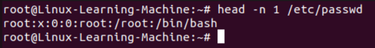  
```
帳號名稱:密碼:UID:GID:使用者資訊:家目錄:shell
```
1. 帳號名稱  
   就是帳號名稱，沒什麼好說明的  
2. 密碼  
   早期Unix會用這個欄位來存放密碼，但因為這個檔案所有人都有read權限，這樣太不安全了  
   因此後來把密碼移動到"/etc/shadow"，這個就顯示個x  
3. UID  
   對應到人類閱讀的帳號名稱，除此之外linux對UID有一些規定  
   1) ID 0: 代表系統管理員root  
   &nbsp;&nbsp;&nbsp;&nbsp;&nbsp;
   假設要讓其他帳號也具有root，可以將該帳號的UID改成0 (一部電腦內不見得只能有一個root)  
   &nbsp;&nbsp;&nbsp;&nbsp;&nbsp;
   但非常不建議這樣做，有很多安全隱患  
   2) ID 1 ~ 999: 代表系統帳號  
   &nbsp;&nbsp;&nbsp;&nbsp;&nbsp;
   其實和一般的使用者帳號權限相同，因為在系統服務上，通常不希望讓它擁有過多權限  
   &nbsp;&nbsp;&nbsp;&nbsp;&nbsp;
   和一般的帳號不同點是這些帳號通常是不可登入的  
   &nbsp;&nbsp;&nbsp;&nbsp;&nbsp;
   通常1 ~ 200是由distributions自行創建的，而201 ~ 999則是讓user若有系統帳號需求時創建的  
   3) ID 1000以後  
   &nbsp;&nbsp;&nbsp;&nbsp;&nbsp;
   一般user帳號  
4. GID  
   和"/etc/group"有關，概念和"/etc/passwd"差不多，只是是用來管理group的  
5. 使用者資訊  
   說明這個user，通常這個欄位沒什麼意義，除非自己更改  
6. 家目錄  
   使用者的家目錄，當使用者登入後，會自動進入到期對應的家目錄資料夾內  
   以上面的範例，root登入後會自動進入/root這個資料夾內  
7. shell  
   使用者選擇哪個shell來與系統和kernel溝通  

#### /etc/shadow
原先把密碼放置在"/etc/passwd"內，但因為眾多權限都需要去"/etc/passwd"來查看，因此需要讓大家可以read此檔案  
設成read之後若把密碼持續放置在這裡會有安全問題，所以才獨立出來  
接著來講一下這個檔案的每一行的每個欄位  
因為這涉及到安全性問題就不截圖了  
```
帳號名稱:密碼:最近更動密碼的日期:不可被更動的天數:需要變更的天數:警告天數:寬限時間:失效日期:保留
```
1. 帳號名稱  
   和"/etc/passwd"相同  
2. 密碼  
   這欄是加密過得密碼，每個系統所選擇的加密系統不一樣會導致這裡顯示的長度不一樣  
   但固定的加密系統長度會是固定的，因此很多軟體會透過改變這個欄位的長度來讓密碼暫時失效  
3. 最近更度密碼的日期  
   這個數字是linux以1970/1/1開始計算過了幾天而得出來的天數  
4. 不可被更動的天數 (以3.為基準)  
   距離上次更新要過幾天才能再次更改密碼，0代表想改就改  
5. 需要變更的天數 (以3.為基準)  
   這是經過幾天後系統會強制使用者變更密碼  
6. 警告天數 (以5.為基準)  
   距離強制變更前幾天發出警告  
7. 寬限日期 (以5.為基準)  
   在這個寬限日期內以原密碼登入還是進入，不過系統會強制你更改密碼  
8. 失效日期  
   這個帳號失效的日期，和密碼是否過期無關，通常是用再有收費服務的系統中  
9. 保留  
   保留欄位，目前沒有功能  

### 群組
#### /etc/group
上面看完了兩個檔案，接著在來看群組的檔案  
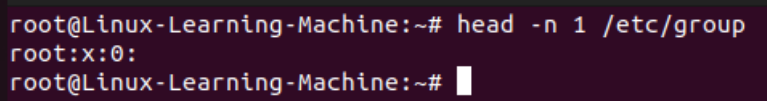  
每個欄位分別代表著  
```
群組名稱:群組密碼:GID:此群組支援的帳號名稱
```
1. 群組名稱  
   和"/etc/passwd"第一欄一樣，代表群組名稱  
2. 群組密碼  
   通常不太需要設定，這邊也一樣不會顯示，移動到"/etc/gshadow"內，所以只會顯示x  
3. GID  
   group ID  
4. 此群組支援的帳號名稱  
   簡單說就是這個群組裡面有誰就會寫在後面，如果想要將某個使用者加入群組，也可以直接填入這個欄位  

#### 初始群組
簡單的說就是在使用者一登入的時候，就會立刻擁有這個群組的權限，也就是我們看"/etc/passwd"上的GID  
我們在上面介紹了"/etc/group"第四個欄位說這個群組有哪些使用者  
但現今的linux已經把initial group的user拿掉了  
如下圖的kevin這個群組並沒有kevin這個user，因為kevin這個群組是kevin這個user的初始群組  
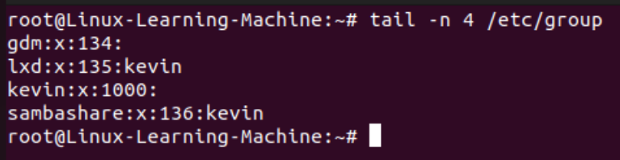  

#### 有效群組
我們先來查看一下我們自己屬於哪些group，可以透過"groups"這個指令  
```
// 先切換到自己user的帳戶
groups
```
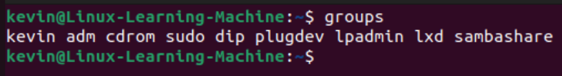  
可以看到一個user可以belong to好幾個group，那如果我們創建了一的檔案，這個檔案會屬於哪個group  
結論是會是屬於有效群組  
那這麼多群組如何確認哪個是effective group?  
答案是在我們用"groups"檢查的時候，第一個顯示的就是有效群組  
所以以上圖為例，kevin就是effective group，所以我們創建的檔案會是屬於kevin這個group的  
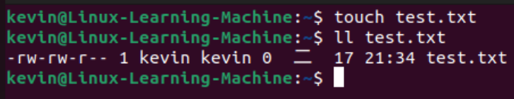  
那我們有沒有辦法切換有效群組  
可以，只要透過"newgrp"這個指令即可，但這個指令有幾個須知  
1. 要切換有效群組必須要是user已經存在的群組  
2. 這個指令它會是創一個新的shell來暫時切換effective group  

"newgrp"基本語法如下  
```
newgrp groupname
```
可以看到這兩個檔案就是belong to different group  
  

#### /etc/gshadow
用來紀錄群組密碼和群組管理員的檔案，不過現今有sudo等等工具所以群組管理原已經越來越少  
不過還是簡單介紹一下每個欄位  
```
群組名稱:密碼:群組管理員帳號:此群組支援的帳號名稱
```

### 帳號管理
#### useradd
用來新增使用者的指令  
基本指令如下  
```
useradd [options] accountname
```
這裡的options有可以指定UID, initial group之類的...  
這邊要注意，Ubuntu這個指令預設是不會自動幫你建置家目錄，這時你可以用"-m"這個option來強制創建  
下面這張圖就完全使用預設得來創建一個user "test1"  
可以看到在"/etc/passwd"等等都可以看到"test1"，但"/home"底下卻沒有"test1"的資料夾  
  
這邊我們加入"-m"這個option來一併建置家目錄  
\* 有先把"test1"這個user砍掉，砍掉指令後面會提  
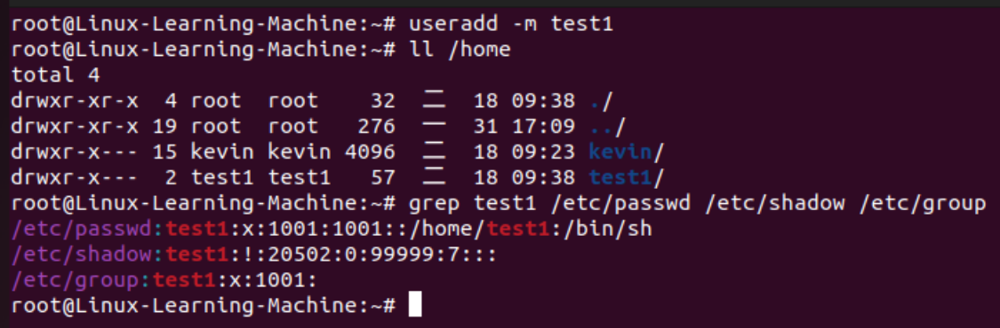  
這個指令也可以用來創建系統帳號，利用"-r"這個option  
可以看到他的UID在999以內  
\* 補充一下，Ubuntu預設設定系統帳號是由高到低分配，所以這裡新創的UID會是999  
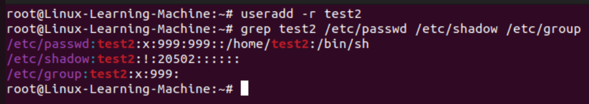  

上面創建了兩個帳號，如果我們完全按照預設創建user，那我們和linux要怎麼知道哪些預設值  
先說我們系統維護者如果要確認預設值，一個簡單的作法是用"useradd -D"來查看  
```
useradd -D
```
如下圖  
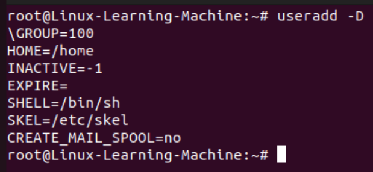  
上面這個指令所show出的東西是去讀取"/etc/default/useradd"這個檔案所得出的  
我們簡單說明一下上面每一項分別代表什麼，若有興趣可以去觀看完整檔案  
1. GROUP=100  
   這一項是新建的user的初始群組會是GID=100這個群組，但是我們看到我們上面"test1"的結果  
   會發現"test1"的initial group GID是1001，而不是100，這是因為不同distribution的機制不同(有兩種)  
   1) 私有群組機制:  
   &nbsp;&nbsp;&nbsp;&nbsp;&nbsp;
   會創建一個和user一樣的群組，這樣user的家目錄就不會被其他人隨意進入修改  
   &nbsp;&nbsp;&nbsp;&nbsp;&nbsp;
   像Ubuntu, CentOS, ...都是這種  
   2) 公共群組機制:  
   &nbsp;&nbsp;&nbsp;&nbsp;&nbsp;
   就是initial group會是GID 100的機制  
2. HOME=/home  
   就是家目錄的base directory  
3. INACTIVE=-1  
   密碼過期後是否會失效，就是在"/etc/shadow"的第七欄位的設定值，-1代表密碼不會失效  
4. EXPIRE=  
   代表著帳號失效日期，對應到"/etc/shadow"的第八欄位  
5. SHELL=/bin/sh
   代表著系統預設給user的shell  
6. SKEL=/etc/skel  
   代表著家目錄的參考目錄  
   簡單的說就是當我們創建一個user的家目錄，它會把"/etc/skel"內有的東西copy過去  
   所以如果希望新創的user有什麼東西可以放在這個目錄裡面，這樣創建時就會自動有我們要的東西  
7. CREATE_MAIL_SPOOL=no  
   是否會主動幫user建立郵件信箱，若要查看可以去"/var/mail"查看(裡面會有user名，若有)  

除了"/etc/default/useradd"這個檔案外，還有些設定是寫在"/etc/login.defs"內，像是UID, GID等等  
因為內容眾多，就不一一列舉了  

#### passwd
上面講了創建使用者，在創建完的時候，預設情況下這個帳號是無法使用的(因為沒有密碼)  
所以接下來就講一下如何更改密碼，那就是要用"passwd"這個指令  
```
passwd [options] [accountname]
```
若是root使用這個指令，後面加accountname，就是幫某個user創建或更新密碼  
在root創建好user後需要做這一步來讓account是可以登入的  
如下圖我們幫test1創建密碼  
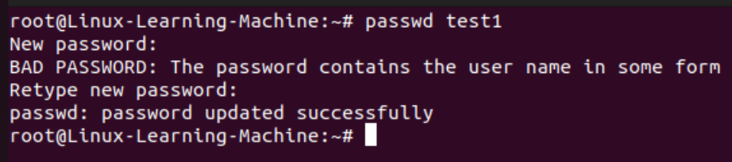  
改好之後給user，user可以自己在改，這時就不需要加accountname  
  

#### chage
chage主要可以用來修改帳號密碼的一些設定("/etc/shawdow"內的那些)  
```
chage [options] accountname
```
其中比較有的是，我們可以透過把最近一次更改密碼的日期設成0，來讓user一登入後強制更新密碼  
方法如下  
可以看到它會說password must be changed  
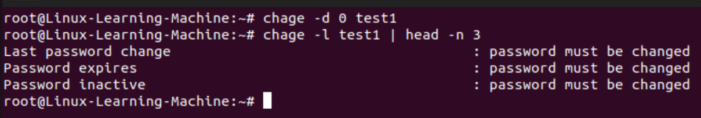  
當我們登入時，它就會強制要求我們更新密碼  
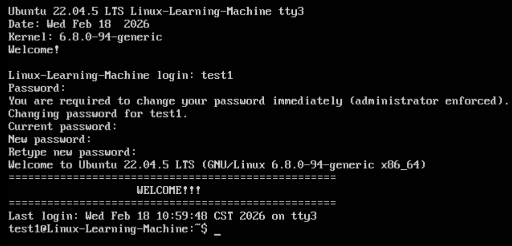  

#### usermod
user modify，有的時候我們可能會在useradd的時候設置錯誤的參數，這時可以用"usermod"這個指令來修該  
```
usermod [options] accountname
```
基本上其options和useradd差不多，因為它只是做修改而已  
這邊就示範一個加上使用者資訊  
```
usermode -c message accountname
```
可以看到加上user info之後，就會在"/etc/passwd"第5欄有對應的description  
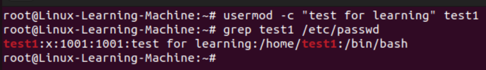  

#### userdel
這個指令相當簡單，就是把user account砍掉  
如果想要完整的將某個帳號移除，最好在下達指令前先"find / -user accountname"找出所有檔案並刪除  
因為如果user使用一段時間，可能會有一些檔案紀錄  
```
userdel [-r] accountname
// -r: 連同家目錄等等一併砍掉
```
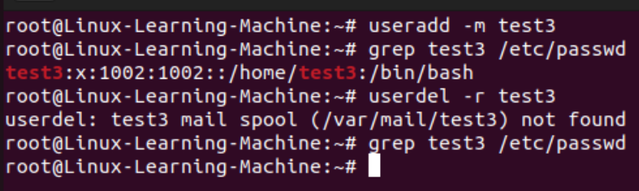  

### 使用者功能
上面的那些指令，大多都是跟管理員管理帳號有關的操作，接下來講一些一般user也能變更查詢的指令  
#### id
查詢某個account的UID, GID, ...  
```
id [accountname]
```
這個指令也可以用來確認有沒有這個帳號  
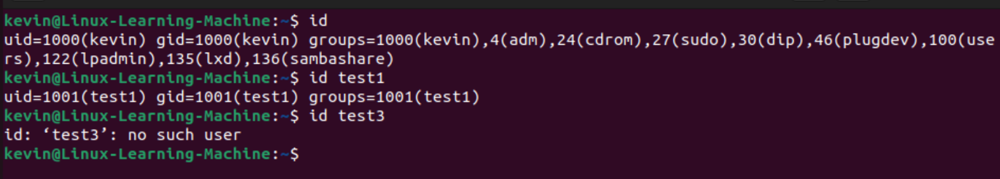  

#### chfn
他是用來修改一些user info的(老實說這個指令的用處不大，不過還是可以試試看)  
基本語法  
```
chfn [options] [accountname]
```
一開始會要輸入密碼核對身份，然後填一些基本訊息，之後會顯示在"/etc/passwd"的第5欄  
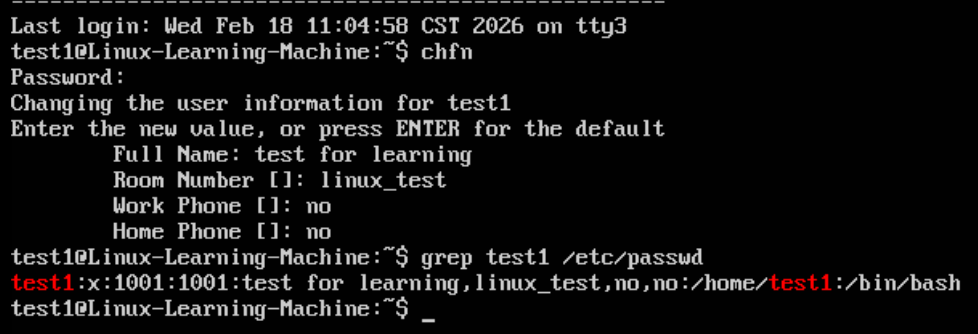  

#### chsh
change shell，基本用法如下  
```
chsh [-s] [shellname]
// -s set shell
```
通常我們會先確認有哪些shell可以使用，再去更改它  
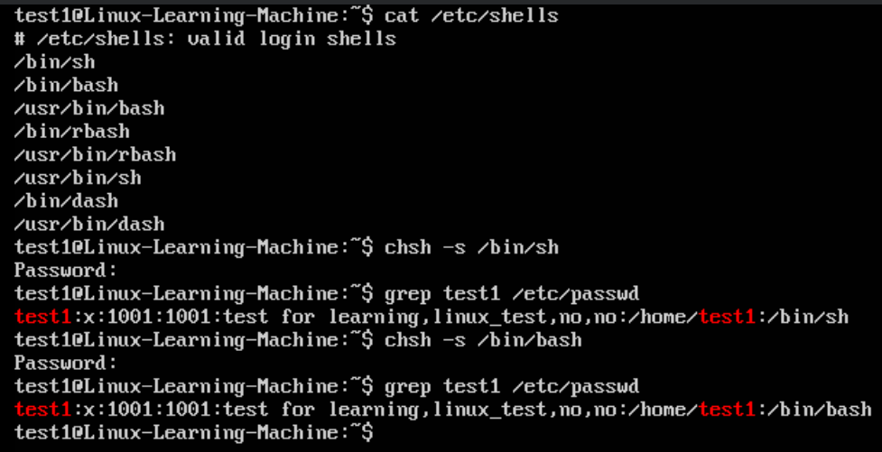  

\* chsh和上面說的chfn都是屬於SUID的功能(暫時切換權限，讓指令能夠使用某些檔案或功能)  

### 群組管理
前面介紹了user的管理，這邊就要介紹一下群組的指令，其實和user的大同小異  

#### groupadd
可以看得出來和"useradd"差不多，創建一個新群組  
```
groupadd [options] groupname
```
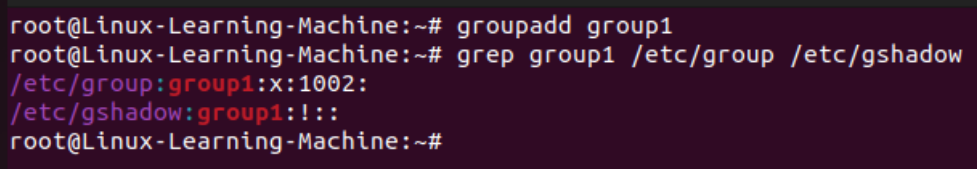  
若是要將某個user加入某個群組，則是用前面教過得"usermod"指令  
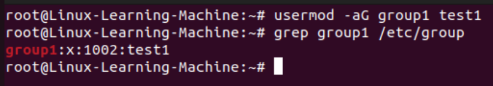  

#### groupmod
對應到"usermod"  
```
groupmod [options] groupname
```
這邊就把剛剛創的"group1"改名成"group_test"  
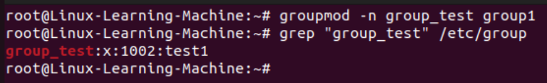  

#### gpasswd
在前面我們有提到，如果要把user加入某個群組，可以使用"usermod"指令  
實際上也可以使用"gpasswd"指令  
"gpasswd"指令實際上群組管理員的功能，因為如果每件事都要麻煩系統管理員，它必定分身乏術  
所以就可以用這個指令來指派群組管理員，同時管理員可以作到新增或刪除群組user  
若不加options，則是給這個group密碼  
```
gpasswd [options] groupname
```
這邊就將我們剛剛改名的"group_test"裡的"test1" user給移除  
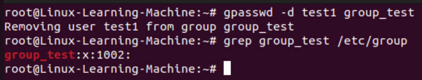  

#### groupdel
就是把群組給刪除，但要注意，若這個群組還有user，它就無法刪除  
```
groupdel groupname
```
剛剛我們已經把"test1"給移除群組，這邊我們就來把"group_test"給刪除吧  
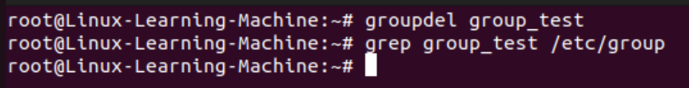  

## ACL
Access Control List，因為傳統linux只能真的owner, group和others進行權限設定  
而ACL則是進行細部設定，ACL可以針對單一user, 單一檔案或是單一目錄進行權限設定  
舉例來說，假設有個目錄要給某個group有操作權限，但有些人要能夠可以修改檔案，而有些人只能read  
傳統linux無法作到，就必須得要用ACL來設定  

ACL原本是unix-like os的額外支援項目，但因為上述例子的需求相當常見，因此現在ACL幾乎都已經是預設功能  
後面接著介紹要怎麼設定ACL  

### 設定ACL
#### setfacl
設定某個檔案or目錄的ACL項目  
```
setfacl [options] [-m|-x acl_parameters] dirname/filename
// -m 設定acl_parameters
// -x 刪除acl_parameters
```
這邊我們創了一個檔案，並設定"test1"對這個檔案有rx的權限  
所以我們可以看到在權限那邊後面多了一個"+"  
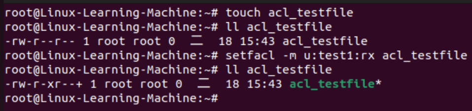  

\* 這邊提一下"u:"後面是接user但如果沒有指定，例如"u::rwx"那這時候的user會是檔案owner  

可以設定user，還可以設定其他東西  
1. group 
   把"u::"的"u"換成"g"  
2. mask  
   把"u::"的"u"換成"m"  
   mask的意思是說即使我設定了某個user或group的權限，但那些權限必須要在mask內才有用  
   例如mask是"r _ \_"，假設設定了某個user權限是"r_x"，那它也還是只會有"r"的權限  
3. 權限繼承  
   在"u::"的最前面加入"d:"變成"d:u::"  
   他的意思是設定這個目錄的權限後，之後在這個目錄底下創建的目錄或檔案都會繼承這個設定的權限  

#### getfacl
前面我們用"setfacl"設定了細部權限，我們可以看到權限那邊有個"+"  
但如果我們想要完整觀看呢，那就得要用"getfacl"  
```
getfacl [options] dirname/filename
```
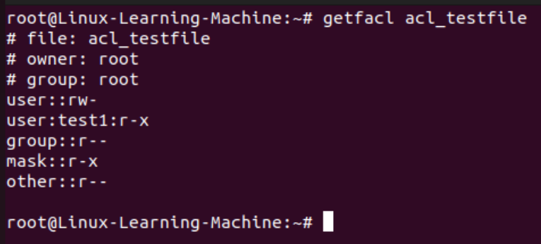  

## 使用者身份切換
在linux中通常會有一般帳號或是較低權限的帳號去使用或啟用某些服務，甚至有些軟體會禁止高權限帳號使用  
但有的時候還是會需要一些系統權限的操作，這時候就要進行身份切換  

### su
"su"這個指令是直接將身份變成root，這個指令需要***root密碼***  
在ubuntu預設中，root帳號是沒有設定密碼的(當然可以自己設定)  
但ubuntu推薦使用"sudo -i"來讓你的帳號切換成***root權限***  
因此這邊就不特別介紹"su"只要知道他是讓你切換成root帳號即可  

### sudo 
"sudo"是暫時讓你獲得root權限去執行指令，"sudo"是輸入自己的user密碼    
而"sudo -i"前面有提到這是讓你的帳號切換成***root權限***  
但能執行"sudo"的帳號會寫在"/etc/sudoers"這個檔案中，在這個檔案中的user才能夠執行"sudo"  

不過前面幾個章節已經用了這麼多"sudo -i"所以應該也知道怎麼使用  

### visudo和/etc/sudoers
我們前面有提到，要能夠使用"sudo"這個指令的帳號規則，寫在"/etc/sudoers"內  
但因為這個檔案牽扯到root權限，因此無法用正常的方法編輯，而是要用"visudo"這個指令編輯  
```
visudo
```
會看到像下面的內容  
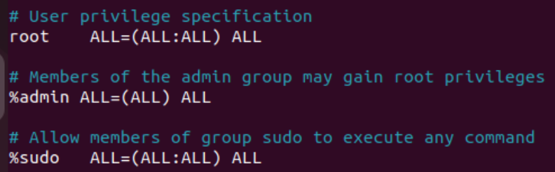  
大致上長這樣  
```
user 主機=(user:group) 指令
```
這邊介紹一下每一欄分別代表什麼  
1. user  
   就是誰  
2. 主機  
   就是主機名稱，如果只是針對本機的話，這邊寫ALL即可  
   如果有要透過sudo對其他網路上特定的主機下達指令，就要在這欄設定 
3. (user:group)  
   意思是可切換的身份，root可以切換成任何人，所以是ALL  
4. 指令  
   是指可下達哪些指令  

但在ubuntu並不推薦用修改這個檔案的方式來某個user使用"sudo"  
在ubuntu裡面有"sudo"這個群組，在這個群組內可以使用"sudo"這個指令  
所以推薦的方法是把user加入"sudo"這個群組  

## 特殊shell
### /usr/sbin/nologin  
這是一個非常特殊的shell，它無法使用bash或是其他的shell登入系統，但它可以取得其他系統資源  
這樣的設計是因為某些程式會需要創建許多帳號，但這些帳號為了安全問題最好不要讓它獲得登入系統的功能  

在這邊我們先把我們前面創建過得系統帳號"test2"將shell用"usermod"改成"/usr/sbin/nologin"  
在切換成"test2"看看  
會發現無法登入  
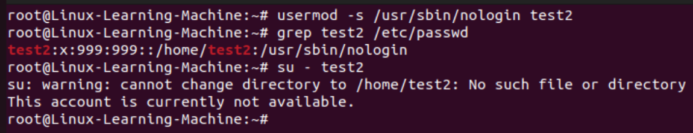  

## PAM
Pluggable Authentication Modules，他是一套API  
這個API最主要的目的就是讓登入驗證這件事情模組化  
它提供了一套驗證機制，只要須易驗證的程式將需求告知PAM，它就會回報成功or失敗  
今天假設沒有PAM，我們將所有驗證的程式些在每個應用程式中，今天我稍微改了一個驗證的部份  
就會需要將所有有用到這種驗證的程式碼一個一個抓出來修改  
有了PAM之後，程式就不再需要管驗證的機制，交給PAM處理即可  

## 查詢使用者
### w, who
這兩個指令可以查看目前以登入在系統內的使用者有誰  
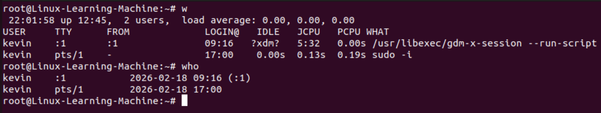  

### lastlog
這個指令可以查看每個帳號最近登入的時間  
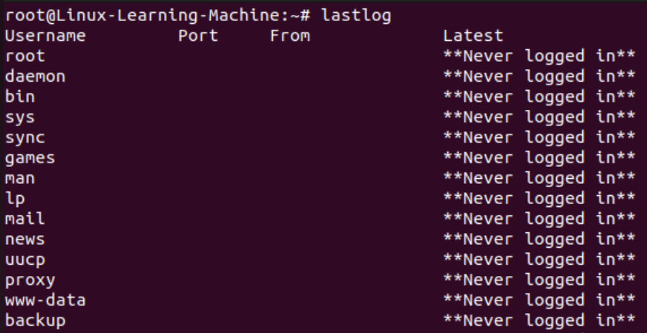  
