# File & Disk system
## User & Group
Linux為了確保共同協作且保留自己的隱私，因此linux有使用者及分群的概念，分成以下三類:  
1. 檔案擁有者  
   顧名思義這個檔案是此帳號所擁有  
2. 群組  
   這個檔案的擁有者是屬於哪個群組的  
3. 其他人  
   群組以外的人  

概念圖如下:  
整個橢圓是整個linux的帳號，每一個小點都是一個user，每一個大圈則是一個gorup  
對藍圈來說，藍圈外的都是others，綠圈也是相同概念  
唯有一個除外，那就是root，root有權訪問任何東西  
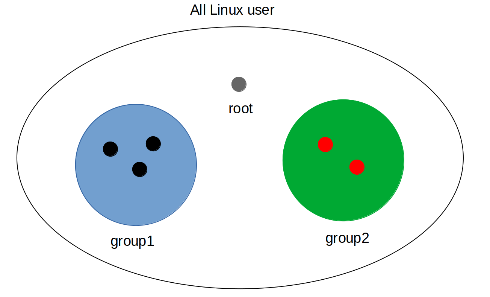  

## Linux檔案屬性
有了使用者概念，那linux如何用使用者概念來共同協作和保留隱私呢，那就是要用檔案屬性  
我們先下 (有先登入root)
```
ls -al
```
可以看到以下的樣子
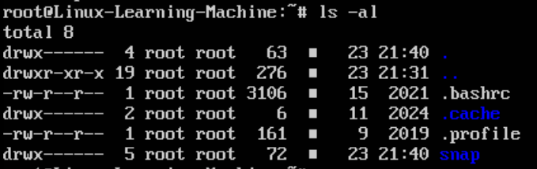  
他的對應關係如下 (日期那邊有個正方形式因為沒有改成en_US.utf8)  
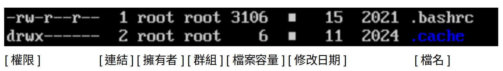  

這邊較重要的就是第一項權限  
```
-rw-r--r--
```
第一項代表著檔案類型 (-代表檔案，d代表目錄，還有其他的像是l之類的)  
接著每三個一組，分別代表著owner, group & others的讀寫和執行的權限  
r: 代表可讀 (read)  
w: 代表可寫 (write) 
x: 代表可執行 (execute)  
-: 無此項權限  

### 改變權限
以下的 [-R] 都是可選的選項，代表recursive  

1. chgrp (change group)  
   改變一個檔案的群組  
   ```
   chgrp [-R] groupname dirname/filename
   ```
   例子 (test.txt這個檔案從group root -> kevin)  
     
2. chown (change owner)  
   改變username，也可以用來改變群組  
   ```
   chown [-R] username dirname/filename
   chown [-R] username:groupname dirname/filename
   ```  
   例子 
   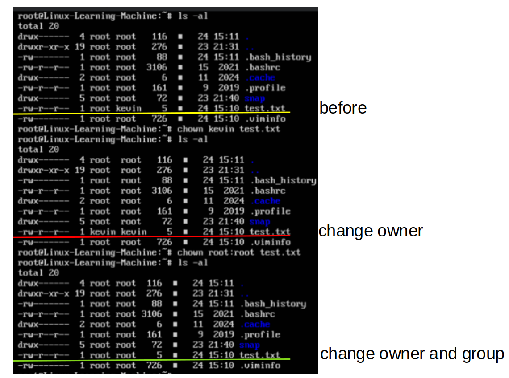  
3. chmod (change mode)
   改變權限  
   前面講到rwx分別代表的意義，這個在電腦上其實是以二進位3個bit來代表1代表有權限0代表沒有  
   因此 r: $2^{2}$ = 4, w: $2^{1}$ = 2, x: $2^{0}$ = 1，所以假設全部都有就是7  
   因為權限又有分owner, group & others的權限，所以可以形成一個三位數字 xyz 來分別代表權限  
   例如:  
   777 分別就代表著owner, group & others所有權限都有  
   774 就代表著owner & group有所有權限，但others就只有讀的權限  
   ```
   chmod [-R] xyz dirname/filename
   ```  
   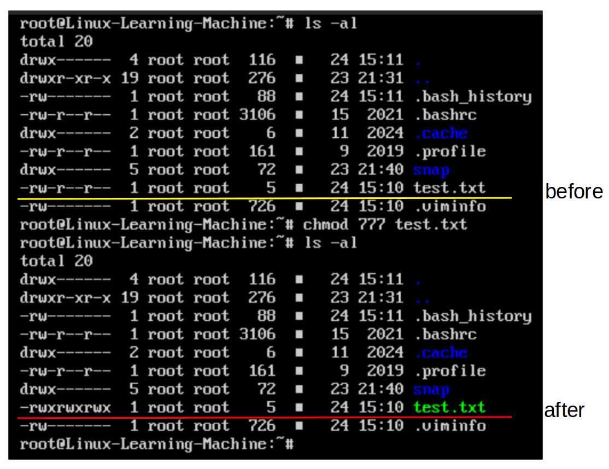  
   也可以用u/g/o/a (user/group/others/all)和+/-/= (加入/去除/設定) rwx 來設定  
   例如:  
   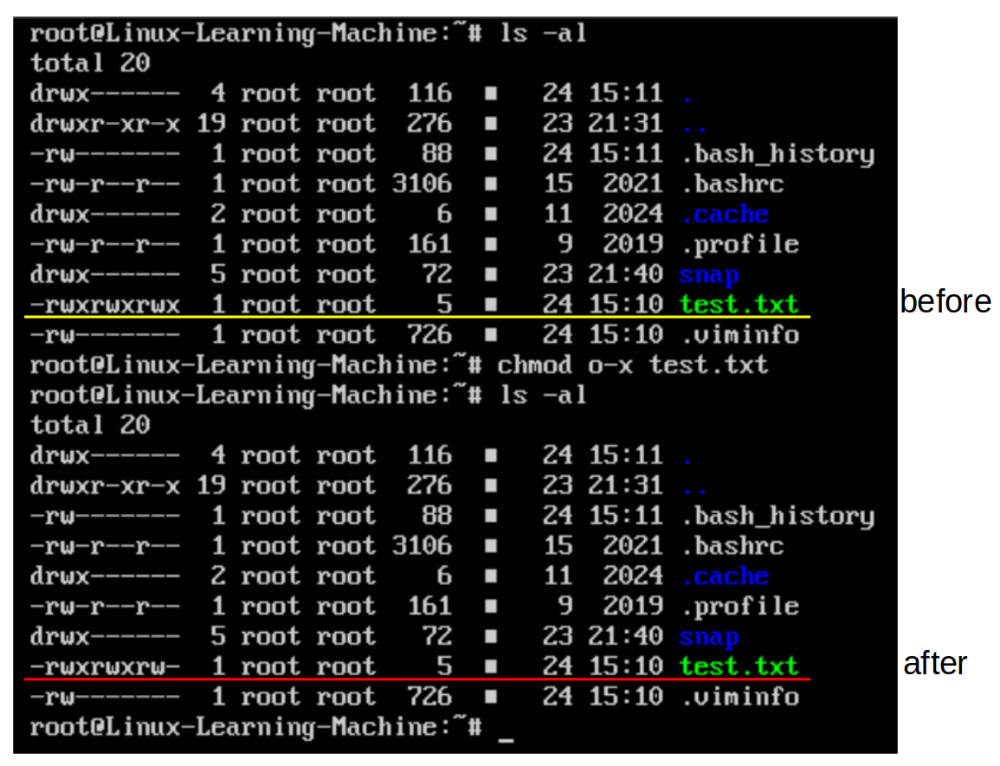  

### 權限對於檔案及目錄的意義
rwx對於檔案以及目錄的意義其實是不一樣的  

對於檔案來說:
1. r: 可以讀取該檔案內容  
2. w: 可以編輯, 新增or修改此檔案的內容 (無法刪除此檔案)  
3. x: 可以讓系統執行此檔案的權限  
   注意! 有執行權限和可以執行是兩回事，像上面的test.txt有執行權限，但此檔案對系統來說是無法執行的  
對於目錄來說:
1. r: 可以讀取目錄下的內容，列出or查詢有哪些東西在此目錄下  
2. w: 具有新增, 刪除, 搬移等在此資料夾內的檔案的權限  
3. x: 可否進入資料夾的權限  

比較有意思的是，為什麼刪除檔案室歸屬於目錄的權限而非檔案的權限  
因為檔案的權限只限縮在檔案本身，假設你要刪除此檔案，其實真正影響的是在系統上的路徑問題  
因此會歸屬於目錄的權限  

## Linux檔名及副檔名
### 檔名
Linux的檔名有幾個特點和限制  
1. 盡量避免一些特殊字元，例如: \*, ?, !, &, ...  
   因為有一些指令可能會需要用到特殊字元，尤其是空白，為了避免麻煩盡量避免  
2. 檔名長度，是根據檔案系統來設定，以xfs為例  
   檔案名稱長度支援255 bytes，所以用英文的話可以有255個字 (英文佔1 byte)  
   若是中文的話則是128個字 (中文佔2 bytes)  
   基本上都是夠用的  
3. 若檔名是由"."開頭，例如".bashrc"，則表示此檔案是隱藏檔案  

### 副檔名  
其實linux並沒有所謂的副檔名，因為在linux能否被執行是看權限以及檔案內容，和windows不同  
但在linux還是有副檔名，但用途是讓使用者了解該檔案屬性而已  

## FHS
Filesystem Hierarchy Standard，用途是為了讓所有人在使用時所有的架構是一致的  
假設說今天大家把檔案放在自己習慣的位置，可能會造成大家使用不同的linux distibution會要各自去找檔案位置，還要去改動一些設定檔的路徑，造成維護上的困擾  

所以FHS先定義了目錄的四種交互型態:  
1. 可分享 (shareable) or 不可分享 (unshareable)  
   可不可分享給其他系統掛載or只適合在自己的機器上面運作  
2. 不變 (static) or 可變 (variable)  
   資料不會經常變動，讓大家有同一套標準，例如函式庫  
   經常改變的資料，例如登錄檔案  

事實上，FHS對於目錄樹，只明確定義以下三種目錄該放什麼資料:  
1. / (root, 根目錄) 與開機系統有關  
   root是整個系統最重要的目錄，所有目錄都是從root衍生出來的，且此目錄跟開機/還原系統有關  
   若是root內存放越多東西，出錯的風險就越高，因此此分割槽要越小越好，且其他安裝軟體盡可能不要放在同個分割槽  
   為此FHS有定義出root底下應該要有哪些目錄，即使沒有也最好有連結檔 (也有建議要有哪些目錄)  
   這邊就不特別列出來，有興趣自己去查  

2. /usr (Unix software resource) 與軟體安裝/執行有關  
   /usr是屬於shareable & static，所有系統預設的軟體都會在此目錄底下  
   FHS建議所有軟體開發者將開發好的軟體放置在此目錄下，而不要獨自建立目錄  
   同樣FHS也有定義要有哪些和建議有哪些目錄，一樣不一一列舉  

3. /var (variable) 與系統運作過程有關  
   /var是系統在運作後會漸漸使用到的目錄，儲存一些常態性變動的檔案  
   例如log file, cache等等  
   同樣FHS也有定義要有哪些和建議有哪些目錄，一樣不一一列舉  

## 目錄與路徑
### 相對路徑與絕對路徑
相對路徑: 相對於當前路徑的路徑
絕對路徑: 從root出發到目標檔案的路徑 (root是一切linux的最上層目錄)

我們常看到一些特殊符號其實也代表相對路徑
1. "." 當前目錄  
2. ". ." parent directory  
3. "-" 上一個所在的目錄  
4. "~" 目前使用者的家目錄  
5. "~account" account這個使用者的家目錄

### 目錄和檔案相關操作指令
有一些指令的可選參數很多，多的我就不一一列舉了，自行--help查看  

#### cd
change directory，變換目錄  
```
cd 相對路徑/絕對路徑
```
例子 (可看到目錄有改變)  
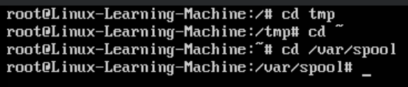  

#### pwd
print working dircetory，顯示目前路徑 (-P表示完整路徑而非link)  
```
pwd [-P]
```
例子 (pwd和pwd -P不同原因是在ubuntu /var/spool/mail其實是/var/mail的link)  
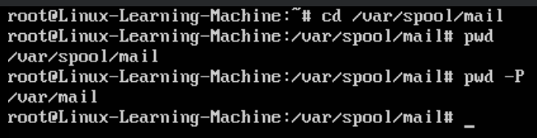  

#### mkdir
make directory，創建目錄
```
mkdir [-mp] dirname
```
例子  
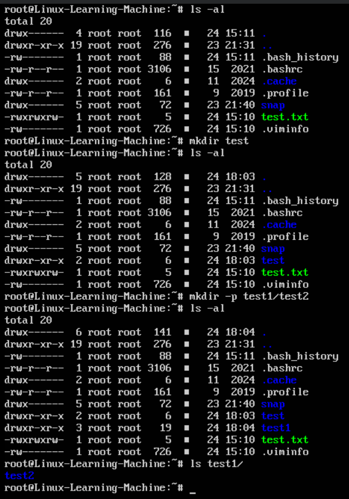  

#### rmdir
remove directory，把資料夾刪除  
```
rmdir [-p] dirname
```
例子  
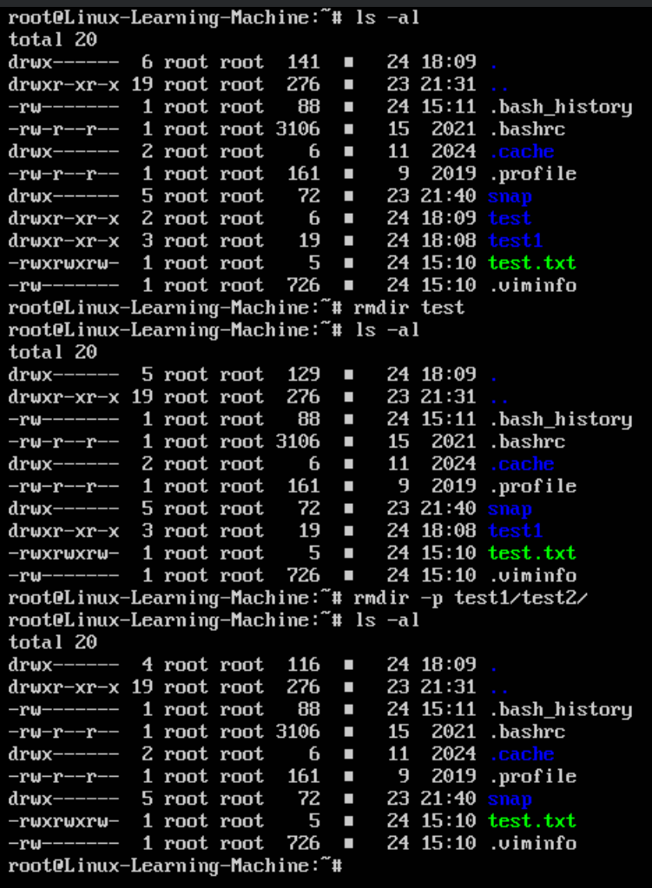  

#### ls
list，把此目錄下的內容列出來 (前面已經用很多了XD，就不多提了)  

#### cp
copy，複製檔案  
```
cp [options] source destination
cp [options] source1 source2 ... directory
```
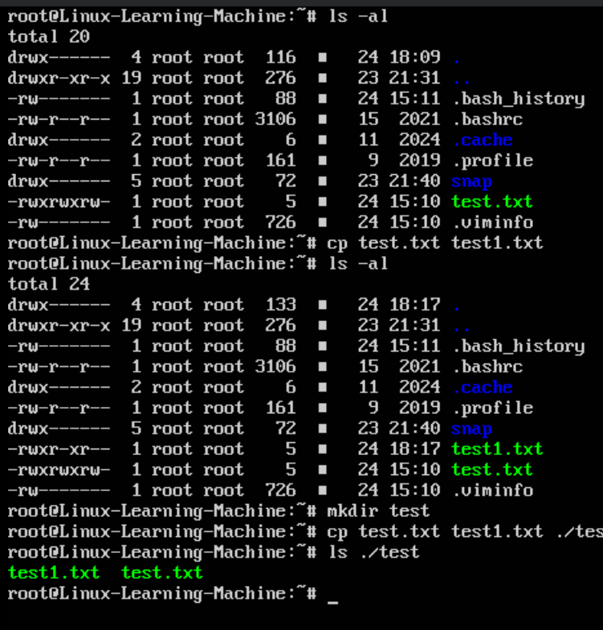  

#### rm
remove，和rmdir類似 (-f是force，要注意-f是不詢問直接刪除，使用前應確認清楚)  
```
rm [options] dirname/filename
```
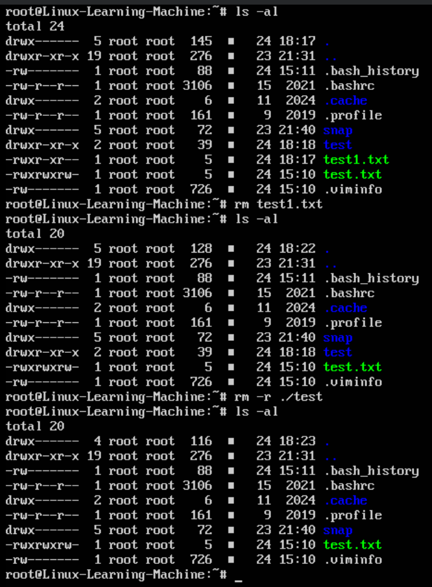  

#### mv
move，用來移動檔案or重新命名檔案  
```
mv [options] source destination
mv [options] soruce1 source2 ... directory
```
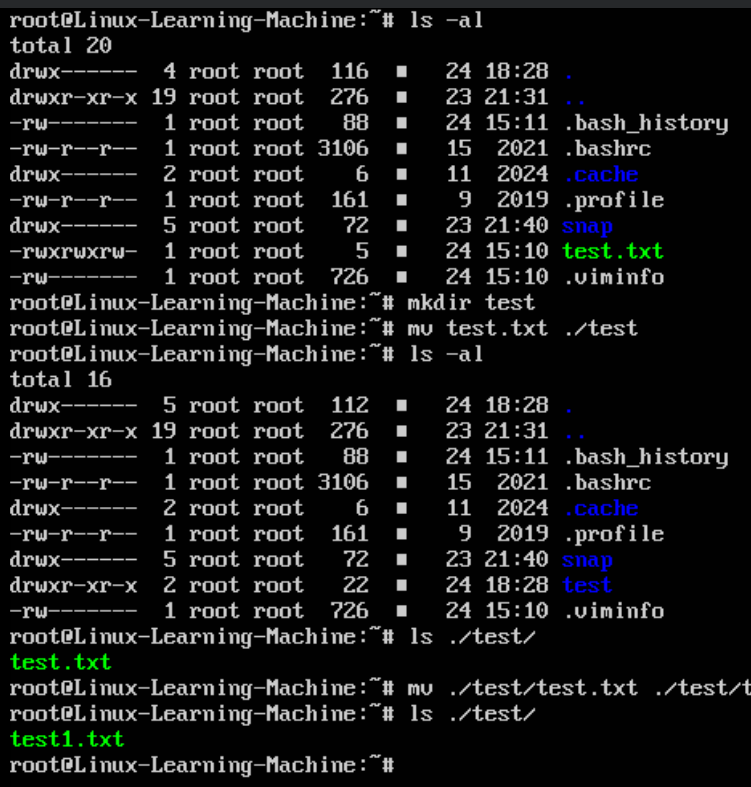  

#### basename
取得檔案名稱  
```
basename filename
```
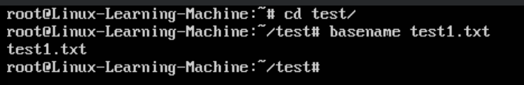  

#### dirname
取得目錄名稱  
```
dirname filename
```
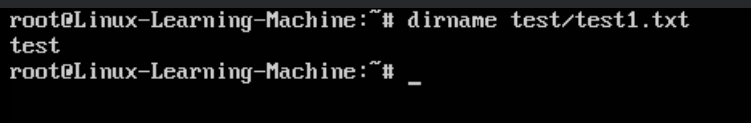  

## 檔案內容查閱
要查閱檔案內容有多指令，例如cat, more, less, ... 這邊就不一一解釋，只介紹一些比較特殊的  

### od
od是查閱非文字檔的的檔案指令，像是執行檔通常是binary file，若用正常讀取文字檔的指令讀去會是亂碼  
type是要以那一整方式顯示
```
od -t [type] 檔案
```
例如/etc/issue
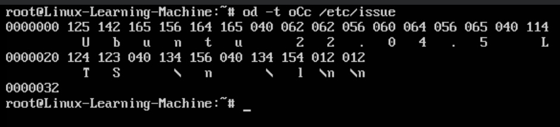  

### touch
有來修改檔案時間or建置新檔案  
每個檔案在linux底下會紀錄許多時間參數，主要有三個  
1. modification time (mtime)  
   當該檔案的"內容"被更改時，就會更新此時間 (內容是檔案的內容)  
2. status time (ctime)  
   當該檔案的"狀態"被更改時，就會更新此時間 (狀態像是權限, 屬性...)  
3. access time (atime)  
   當該檔案內容被取用時，就會更新此時間 (例如cat檔案)  
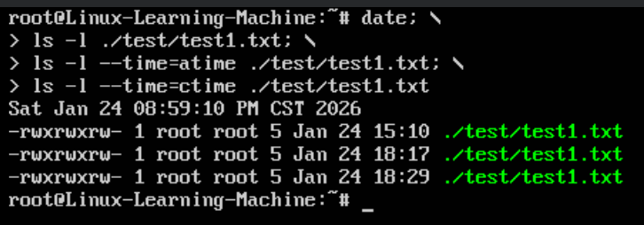  

若有檔案的時間是有問題的，可以用touch指令來修改  
```
touch [options] filename
```
例如將時間調成兩天前 (但ctime不會跟著改)  
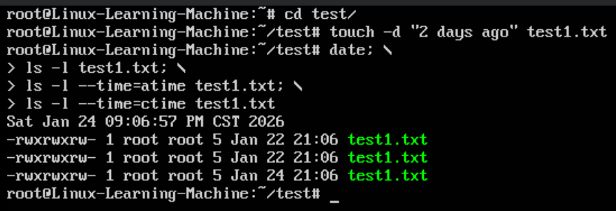  
直接指定時間
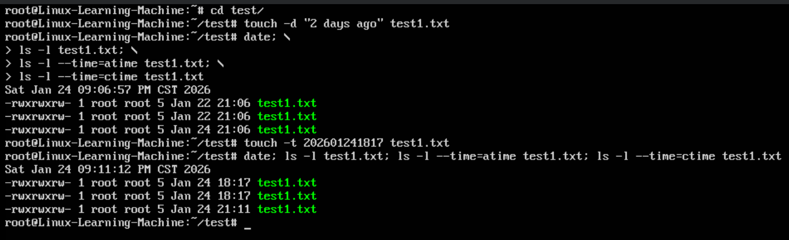  

## 預設權限, 特殊權限和隱藏屬性
### 預設權限 umask
假設建立一個目錄or檔案，可以用umask查看預設權限是什麼  
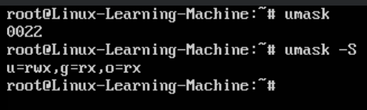  
仔細看會發現，有4個數字，後面三個代表著user, group和others，第一個代表示特殊權限  
```
[特殊權限][user][group][others]
[SUID/SGID/Sticky][user][group][others]
```
SUID, SGID和Sticky後面在介紹  

Umask的數字代表的是預設沒有的權限，像是上圖中的2代表示沒有write這個權限，所以group和others預設是沒有write，這也是為什麼下面一行會是rx，表示有r和x的權限  

我們可以透過以下指令來改變權限 (xyz是數字)
```
umask xwy
```
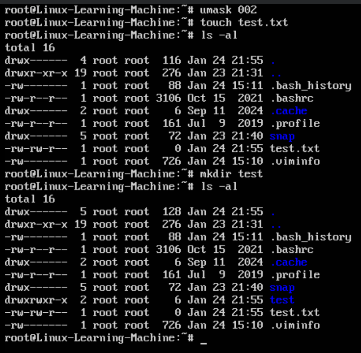  
從上圖可以看到創建的test.txt檔和test目錄的權限分別是"rw-rw-r--"和"rwxrwxr-x"  
這邊會發現檔案三者都沒有x，這個原因是因為linux在創建檔案和創建目錄會分別用666和777來創建  
因為linux預設檔案不會執行，因次都沒有x，其中我們又把others的w拿掉，所以會是"rw-rw-r--"  

### 隱藏屬性
隱藏屬性對於系統有很大的幫助，尤其是在security上面  

#### chattr
設定隱藏屬性，要特別注意，chattr只能在Ext2/Ext3/Ext4的linux傳統檔案系統上面完整生效  
xfs僅支援部份參數  
```
chattr [+-=][options] dirname/filename
```
例如下面的範例+i是賦予這個檔案不能被刪除, 改名, 設定連結, 寫入和新增的屬性  
所以這個檔案無法被刪除
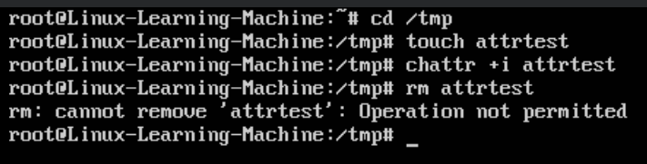  

#### lsattr
顯示可以用來查閱隱藏的屬性  
```
lsattr [options] dirname/filename
```
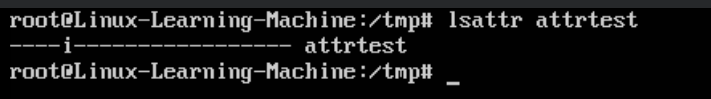  

### 特殊權限
前面有提到有rwx三個權限，但其實還有一些特數權限  
如下圖 (裡面有s, t)  
(若是大寫S, T則表示雖然有開這些權限，但實際上因為user or group沒有x or w的權限，因此實際上無作用)  
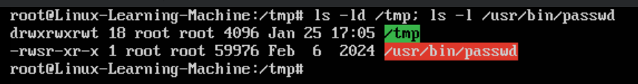  

包含SUID, SGID和SBIT，這三個就是umask的第一位數  
1. SUID: 4
2. SGID: 2
3. SBIT: 1

假設要使一個檔案具有SUID的功能，則會需要在chmod時前面多加一個4，例如:  
```
chmod 4755 filename
```

#### SUID
Set User ID，這個簡單的說是在執行程式時讓執行者短暫獲得檔案擁有者的權限來去存取原本只有檔案擁有者能夠訪問的部份  
像是上圖中的/usr/bin/passwd我們可以看到在原本x的地方變成s，這個是改密碼的指令  
在linux中密碼是存在/etc/shadow裡面，但這個只能由root和shadow這個group才能夠讀  

假設我切換回一般帳號來去cat此檔案會顯示permission denied  
但我們是可以執行passwd的指令來更換密碼
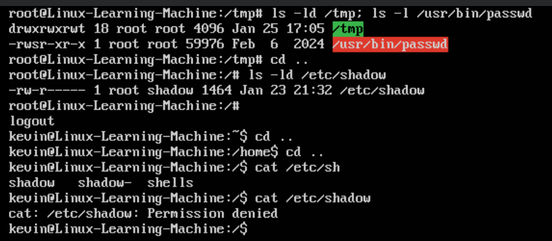  
這是因為我們在執行passwd指令的時候，會被短暫的切換成root，使其能夠訪問裡面的東西  

SUID的限制條件  
1. 僅對binary program有效
2. 執行者需要對該程式有執行權 (像others可以執行passwd)
3. 切換權限只在run-time期間有效  
4. 執行者將暫時具有owner的權限  

\* shell script不會有SUID的權限，因為shell script是多個binary program組成的，但SUID只對binary program有效

#### SGID
Set Group ID，有兩個功能  
1. 用在binary program上面  
   和SUID類似，差別只在SUID是user，而SGID是group，在group那項的x變成s  
2. 用在目錄上面  
   使用者在該目錄下會切換成該目錄的群組，若新增檔案則該檔案的群組會是該目錄的群組  

在共同協作時，就可以避免user的預設群組非該專案資料夾的群組導致創建出的檔案其他成員無法編輯  
例子可以看鳥哥的基礎學習chapter 6情境模擬

#### SBIT
Sticky BIT，目前只對目錄有效，對檔案沒有效  
若此目錄具有sticky bit (t)，則表示在裡面的檔案只有owner和root有權利刪除/更名/移動  
像是/tmp資料夾  

例如用root在/tmp下創建檔案，切換至一般使用者進入/tmp並嘗試刪除此檔案 (無法刪除)  
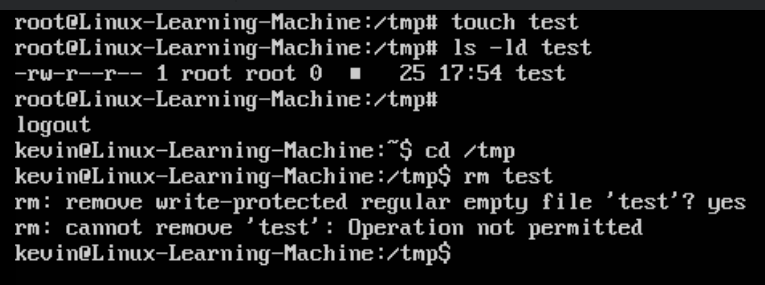  

## 檔案類型
可以利用file這個指令來查看此檔案是什麼類型的檔案
```
file filename
```
例如  
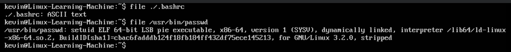  

## 指令與檔案的搜尋
### find
非常強大的指令，他是一個一個檔案去檢查是否符合條件，也因此速度較慢，但非常泛用  
基本上你想的到的條件篩選，都有辦法透過find完成  
```
find [path] [options] [action]
```
例如我想要找當前資料夾下的所有隱藏檔案 (這裡的\*是萬用字元的意思)  
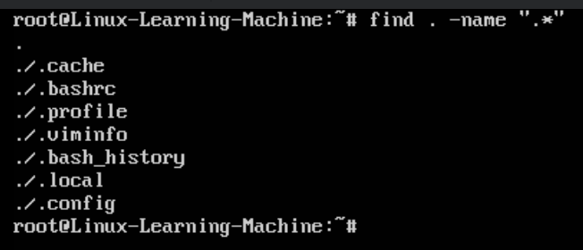  

find還有很強大的地方是它還支援額外指令，例如說找到之外列出他的詳細屬性或是找到之後將其刪除等  
例子 (找到之後show出詳細屬性)  
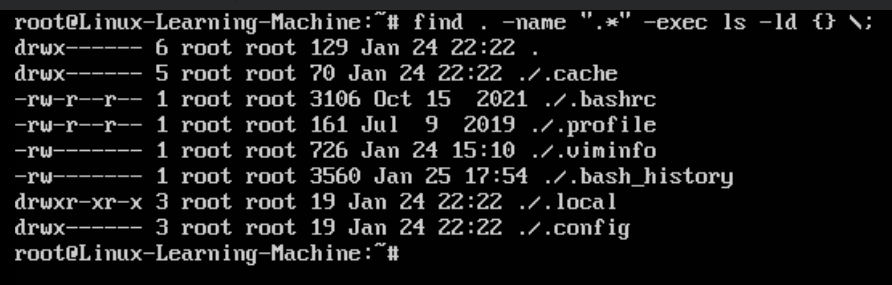  

### which
根據$PATH來去尋找執行檔檔名  
```
which [-a] command
```
例如  
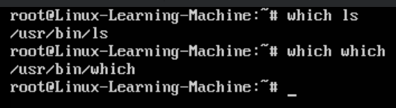  

### whereis
只搜尋特定的目錄，而不做全域搜尋  
```
whereis [options] dirname/filename
```
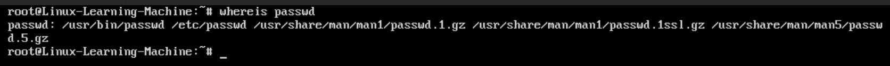  
可以用以下指令查看它搜尋哪些資料夾  
```
whereis -l
```

## 檔案系統特性
檔案系統會將檔案分成兩部份資料，權限和屬性存放到inode中，實際內容資料存放在data block中  
會用superblock紀錄整個檔案系統的狀況  

1. superblock: 紀錄此file system的資訊  
   inode/block的總量, 使用量及剩餘量以及檔案系統的格式等等  
2. inode: 紀錄檔案的屬性  
   一個檔案會有一個自己的inode，紀錄此檔案的內容所在的block nuber  
3. block: 紀錄實際的檔案內容  
   若檔案很大時，則會佔用多個block  

這種用inode (key值) 去找出所有此檔案的data block方法稱為索引是檔案系統 (indexed allocation)  

目錄樹和這個檔案系統要怎麼掛勾呢，那就是在配置目錄時，配置一個inode和至少一個block給目錄  
目錄的block紀錄著裡面的檔案的inode，因此找到到某一個檔案的inode就是從root一層一層的往下找  

\* root和被掛載的目錄的inode則是被紀錄在superblock中

## EXT4 日誌系統功能
### File inconsistent
在介紹日誌系統前要先介紹檔案不一致，若在檔案寫入時出現了不明原因導致系統中斷，會導致僅更新了部份資訊 (檔案的data之外的東西稱為metadata)  
例如: 檔案的inode和block寫好，但這時斷電，導致目錄的block尚未更新等情況  

在早期要檢查這種問題非常費時，因為要把實際的存放資料區域和metadata區進行比對  
所以有了journaling filesystem  

### Journaling filesystem
為了避免file inconsistent耗時的檢查，前人提出了日誌系統  
在filesystem中規劃出一塊專門紀錄寫入和修改檔案的步驟  
1. 當系統要寫入或更新一個檔案時，會先在日誌紀錄區紀錄某個檔案準備要寫入的資訊  
2. 開始寫入or更新檔案的data和其相關的metadata  
3. 完成後在journal紀錄區完成該檔案的紀錄  

因此若出現file inconsistent的問題，也只要去檢查journal就可以知道哪個檔案發生問題  

## 掛載點 (mount point)
將檔案系統和目錄樹掛勾在一起的動作叫做掛載 (mount)  
掛載點一定是目錄，因為只有目錄才有辦法作為檔案系統的入口  
同一個檔案系統 (相同filesyste和superblock) 下，同樣inode號碼會是同樣的東西  
例如  
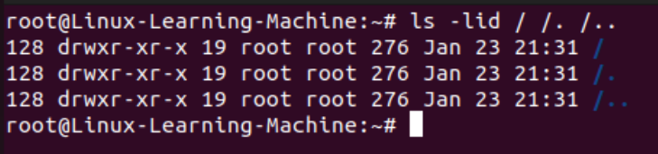  

## VFS
Virtual Filesystem Switch，在linux上支援非常多種filesystem，包含ext4, xfs, fat ...  
但我們實際在使用linux時，要讀取某一個檔案，並不會是先指名說要用哪種filesystem開啟  
這是因為VFS它會管理整個filesystem，在我們要讀取檔案時，它會自動去設定要用哪種filesystem  

VFS示意圖([資料來源](https://e2fsprogs.sourceforge.net/ext2intro.html))  
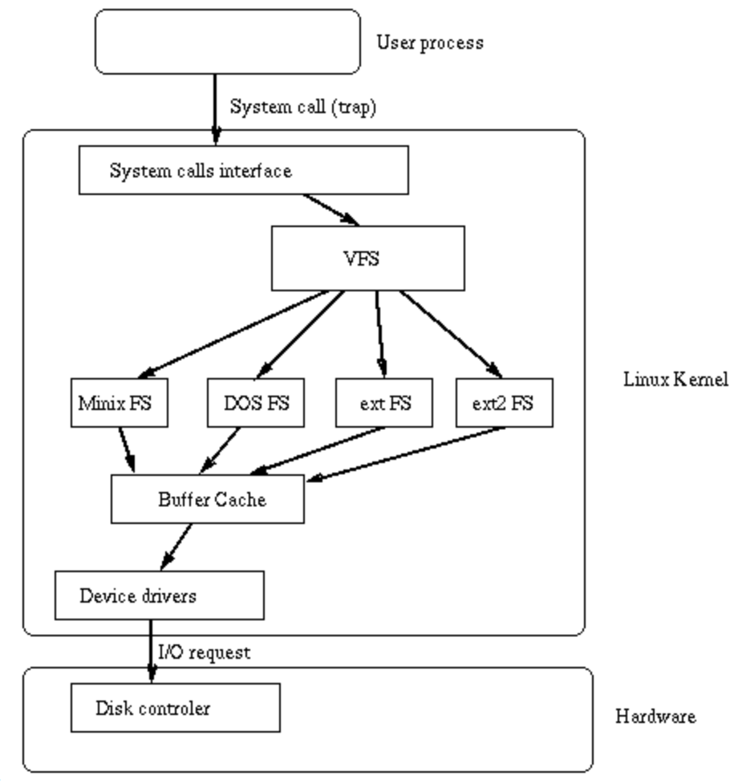  

## XFS
EXT的系統是事先規劃出所有inode/block/metadata等所有東西  
這會導致容量大且要進行格式化的時候耗費大量的時間 (尤其現在容量越來越大)  
因此出現了XFS系統來解決此問題 (透過B+tree & delayed allocation達到動態配置和縮短搜尋時間)  

\* xfs中配置單位是extent (可以簡單理解為利用B+tree所創造的block)  
\* delayed allocation (就是當dirty data在page cache達到一定數量時才去配置)  

XFS分成三個section  
1. data section  
   和EXT的設計差不多，存放inode/data block/superblock等等  
2. log section  
   和EXT的journal system類似，用來紀錄是否有完整寫完，避免不正常關機  
3. realtime section  
   用來處理大量data的部份，若檔案很大，會利用這個section來避免fregamentation  

## 檔案系統的簡單操作
### df
列出檔案系統的整體磁碟使用量  
```
df [options] dirname/filename
```
例如 (-h是human readable，常用)   
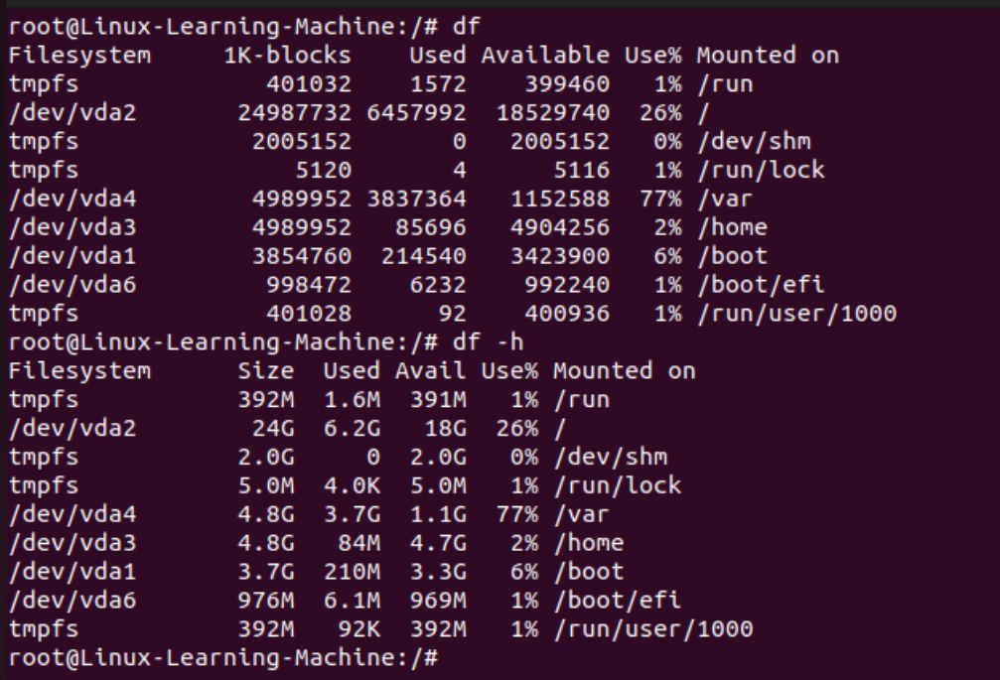  

### du
評估檔案系統的磁碟使用量 (列出每個每個檔案所佔用的block數)  
```
du [options] dirname/filename
```
例如 (這邊有+選項 -sh，summary & human readalbe，要不然會列出一大堆東西) 
  

### ln
在介紹ln前要先來介紹hard link和symbolic link分別是什麼

#### Hard link
在linux中，我們看到的檔名會去指向一個inode，inode再去找到data的位置  
hard link就是讓在同一個filesystem中，不同的檔名完全指到相同的inode  
因此不論用那一個link修改檔案時，會是修改到完全相同的檔案  

hard link有幾個特點  
1. 不能跨filesystem  
2. 不能link目錄，因為會破壞掉目錄數 (inode) 的結構 (變成一個graph)  
3. 此link是跟著檔案走得，所以只要檔案還在，就可以link的到  

#### Symbolic link
symbolic link就是一個檔名指向另一個檔名在指向inode (兩層檔名)  
symbolic link就是winodws的捷徑  

symbolic link有幾個特點  
1. 可以跨filesystem  
2. 可以link目錄  
3. 但因為他是link到檔名，所以只要檔案換個路徑，這個link就會失效

講完了兩種link，來說回ln這個指令  
ln就是創造連結的指令 (若沒有指定options預設會是hardlink)  
```
ln [options] dirname/filename
```
例如 (創建了一個hard link後，裡面inode和block數不變，且兩個檔案的屬性一模一樣)  
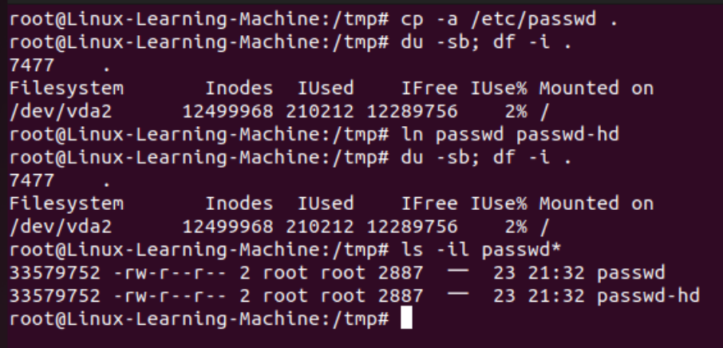  

上面是創建hard link的例子，這邊就創一個symbolic link的例子  
可以看到如果創建一個symbolic link，容量, inode和block數都會改變  
且創建出來的有自己的inode
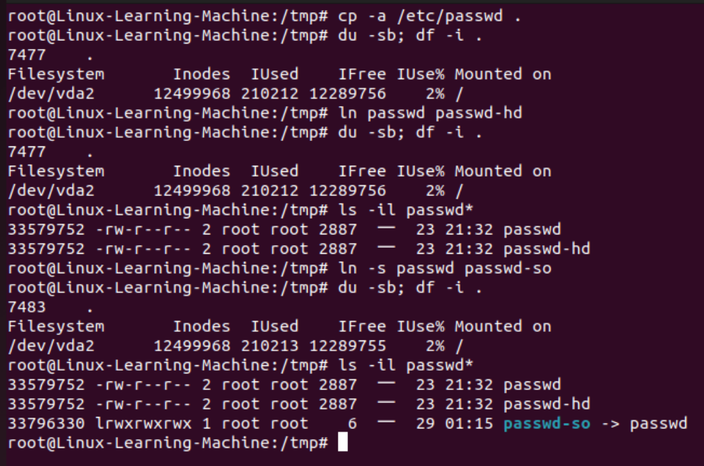  

若把passwd刪除，則會發現，hard link可以正常顯示，但symbolic link無法顯示  
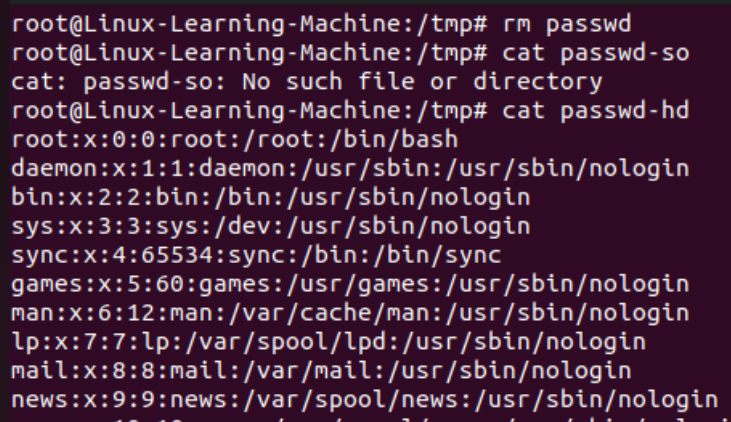  

## 磁碟的操作
### 查看磁碟分割狀
#### lsblk
列出所有儲存裝置  
```
lsblk [options] device
```
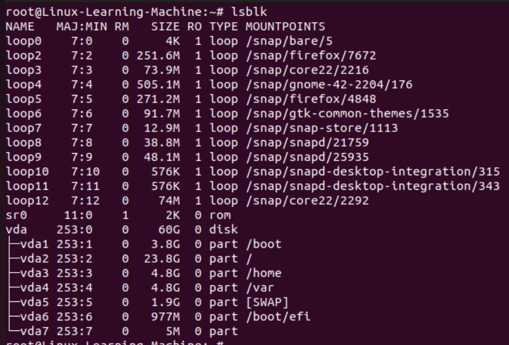  

#### blkid
可以列出裝置的UUID以及檔案系統種類等  
```
blkid
```
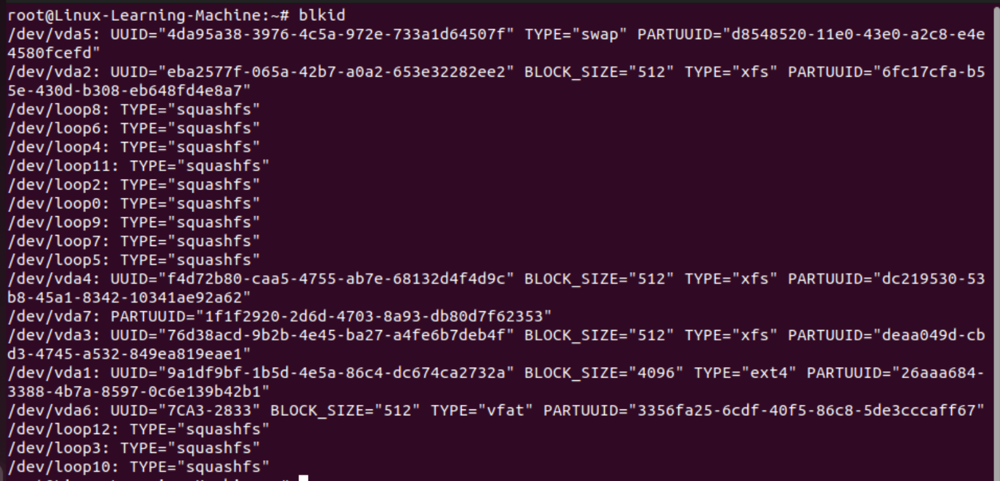  
不過其實用lsblk也可以做到  
```
lsblk -f
```

### 磁碟分割
#### gdisk/fdisk
在磁碟分割上MBR用fdisk，GPT用gdisk  
兩者的用法差不多，因為現在絕大多數都是用GPT，所以以gdisk為例  
此指令只有root才有權限執行  
```
gdisk devicename
```
下完指令後會進入gdisk的文字控制頁面  
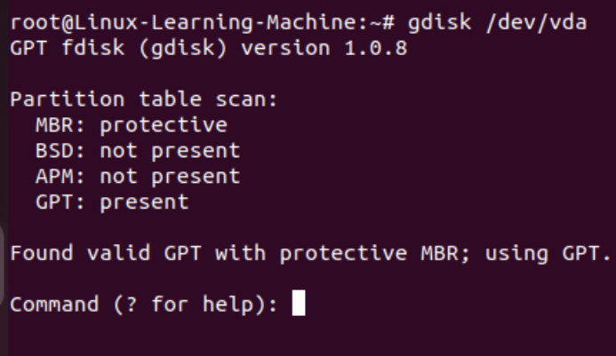  
可以按p查看目前磁碟狀態 (可以看到最後一個partition尚未用完sector)  
裡面的code是linux內部的代號，表示用的是什麼檔案系統
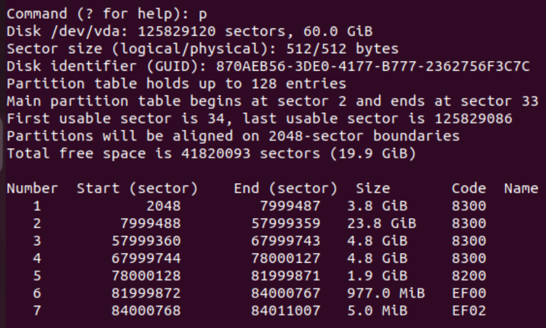  
再來嘗試去新增分割槽  
下n來分割，這邊比較注意的是last sector，如果不主動輸入，它會將剩餘所有空間全部配置進去  
完成之後在顯示可以看到新配置了一個空間  
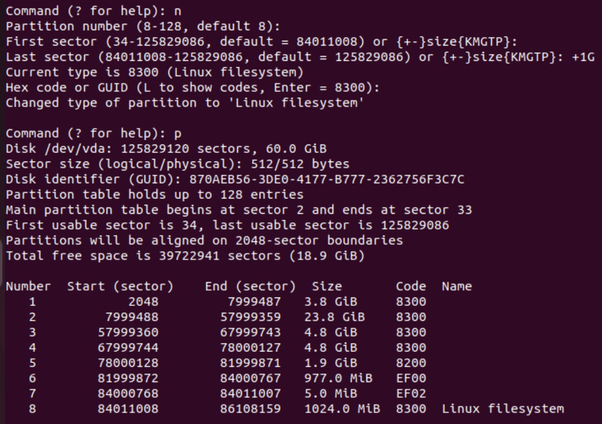  
當完成配置後要按w儲存離開  
若這時候去查看，會發現沒有我們創建的新分割槽，這是因為linux還沒有更新  
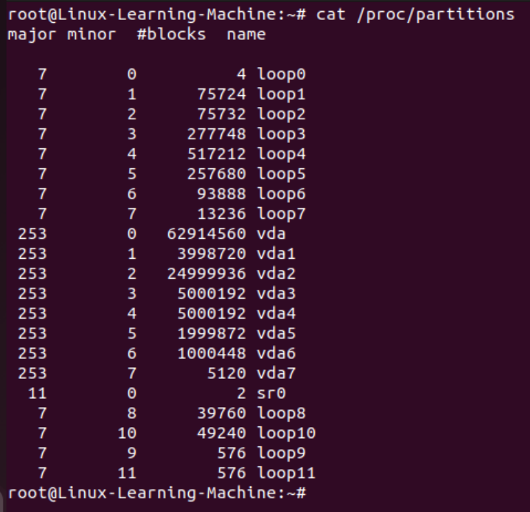  
這時候可以用partprobe來更新 (-s是show出訊息)  
```
partprobe -s
```
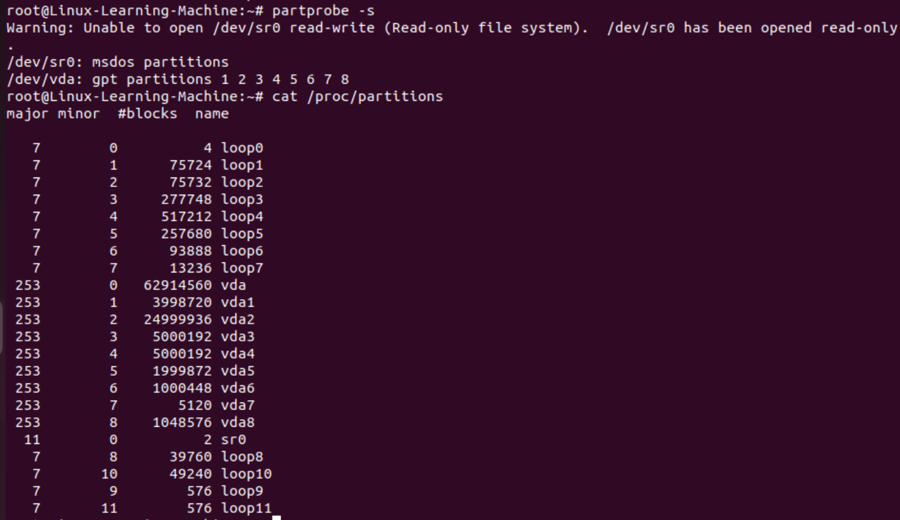  
接著用gdisk刪除一個partition  
在gdisk中用d然後選擇要刪除的partition  
用完記得用partprobe更新系統  
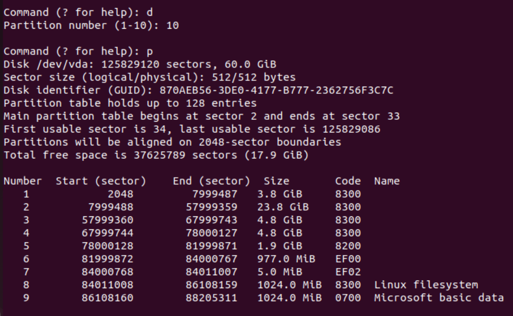  

### 磁碟格式化
#### mkfs
格式化其實是建置檔案系統 (make filesystem)，就是讓這個硬碟使用某個檔案系統  
通常對應的檔案系統就是mkfs$.$xxx (xxx是檔案系統)  
我們可以用linux得自動補字確認有哪些  
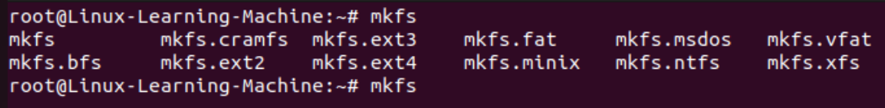  
想要確認裡面對應檔案系統的mkfs指令就打--help，以XFS為例  
```
mkfs.xfs --help
```
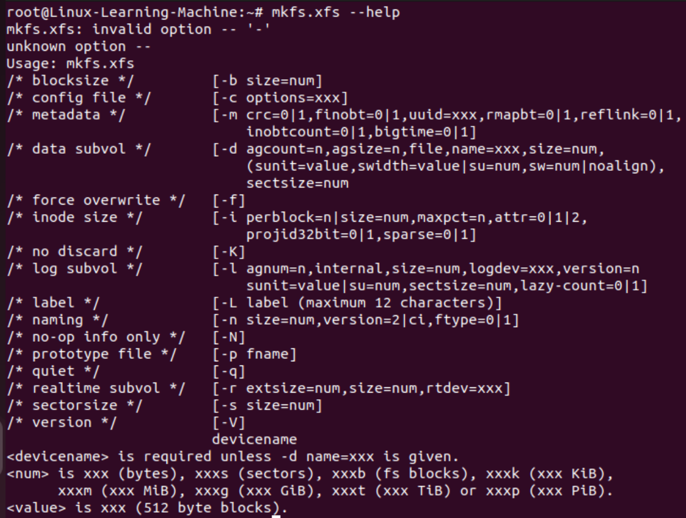  
我們繼續以XFS為例來格式化 (用gdisk創出來的vda8)  
```
mkfs.xfs [options] devicename
```
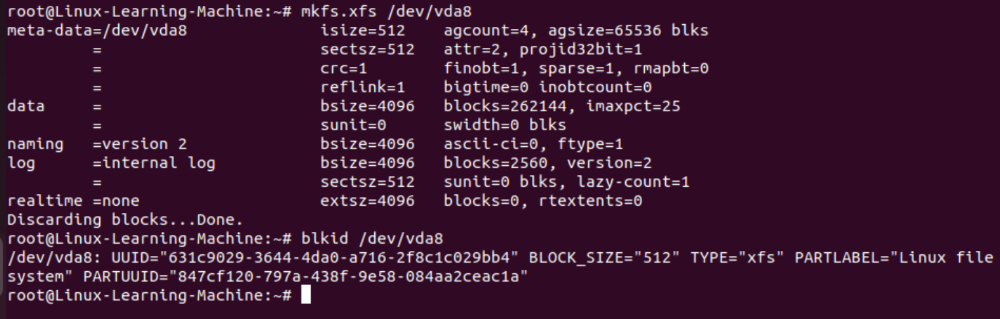  
其實也可以用mkfs -t (mkfs是個綜合指令)  
```
mkfs -t xfs    //等同於mkfs.xfs
```

### 檔案系統檢驗
當電腦當機or不正常關機的時候，有可能會發生file inconsistent  
這時我們可以透過一些指令來操作  

#### xfs_repair / fsck.ext4 
xfs_repair對應到XFS，而fsck.ext4則對應到EXT4  
```
xfs_repair [options] devicename
fsck.ext4 [options] devicename
```
以XFS為例  
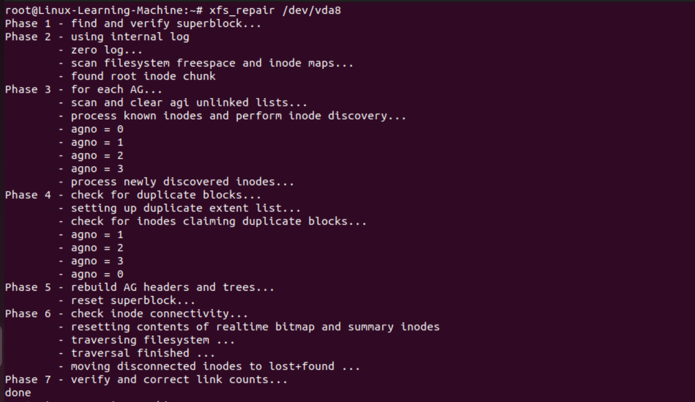  

### 檔案系統的掛載與卸載
前面有說過，掛載就是將檔案系統與目錄樹連結在一起，所以我們需要一個目錄來讓檔案系統和目錄樹連結  
在掛載時，應確保幾件事情  
1. 單一檔案系統不應重複被掛載在多個目錄  
2. 單一目錄不應被掛載在多個檔案系統  
3. 作為掛載的目錄應為空目錄  

第一點和第二點是在指說我們分割出來的空間配置好檔案系統和目錄要是1對1  

#### mount
要掛載目錄，要用到mount這個指令，這個指令其實是一個非常強大的指令  
它真正的功能是修改linux的目錄樹樣子  
不過這邊先簡單的講掛載就好  
```
mount LABEL='' mountdir
mount UUID='' mountdir
mount devicename mountdir
``` 
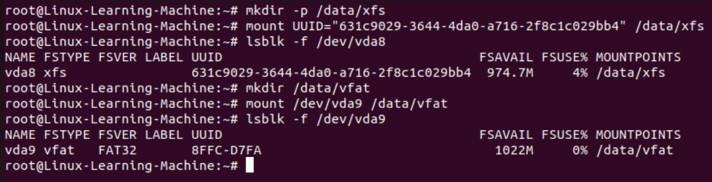  
在上述的方法，因為這些檔案系統是linux內建就已經有的檔案系統且有superblock  
因此mount的時候linux會取讀去superblock來去確認這是那一個filesystem來去掛載  
但若遇到沒有superblock也沒有partition的，則需要在mount時指定  
```
mount [-t filesystem] devicename mountdir
```
上述不論是用LABEL, UUID或是devicename都可以，但最穩妥的是用UUID  
因為UUID是跟著磁碟走得 (格式化完後生成，跟電腦無關)，且UUID幾乎不可能重複  
另外兩個假設今天將磁碟移到另一台電腦上，有可能會有重複的風險  

因為linux的目錄樹當中最重要的就是root (/)，因此root是不能被卸載的，但有的時候會遇到一些問題  
例如電腦出現問題root出現唯讀的狀態  
這種時候可以將它重新掛載變成可寫  
例如  
```
mount -o remount,rw,auto /
```
"-o remount"就是重新掛載，rw就是讓它可讀可寫  

另外mount也可以用作將某個目錄掛到另一個目錄上 (其實概念上跟symbolic link一樣)  
```
mount --bind dirname1 dirname2
```
上面的指令絕大多數都可以用"ln -s"來完成，但有些情況會遇到不支援連結符號的情況，就得用mount  

#### umount
卸載，指令如下  
```
umount dirname
```
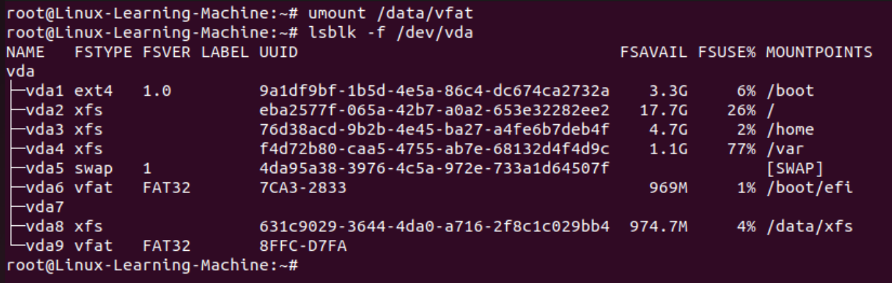  

### 創建裝置檔案
在linux中"Everthing is a file" linux正常情況下會為所有東西建置一個"裝置檔案" (例如: /dev/sda)  
但在某些情況下，linux會無法自動建置，例如: 自己寫的驅動, 極小linux kernel刪除某些供功能等等  
這種時候我們就會需要手動建置"裝置檔案"  
#### mknod
mknod就是用來手動建立檔案的，指令如下  
```
mknod devicename type [Major] [Minor]
```
這邊需要講一下什麼是"Major"和"Minor"
如果我們用"lsblk"或"ls -l"的指令可以看到裝置會有MAJ:MIN，這就是major和minor  
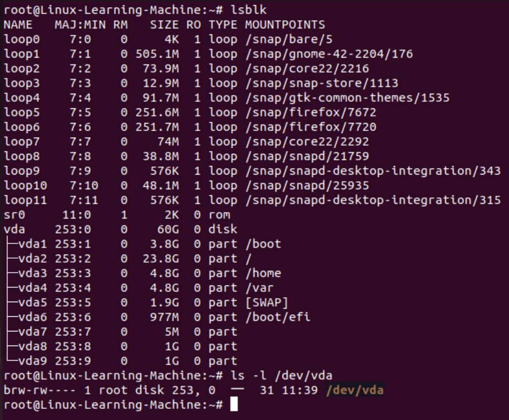  
簡單的說  
Major: 是決定裝置要用哪個驅動程式  
Minor: 是決定哪個驅動後這個驅動程式下第幾個裝置  
若裝置需要驅動的話就需要有major和minor  

但是這裡有個問題，如果linux沒有自動創建出檔案裝置，就不會知道他是哪個major和minor  
這個時候就要自己去查詢major和minor，例如用"cat /proc/devices"查看linux有哪些major  

還有一種常用的情況，就是創建FIFO檔  
什麼是FIFO檔 (pipe檔)，FIFO (又被稱為pipe) 他是兩個process之前的一種溝通橋樑   
在下指令很常用的"|"也是pipe，例如  
```
ls /dev | grep vda*
```
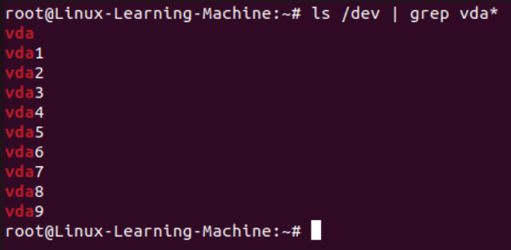  
這個指令的意思是，它把"|"前面的指令的結果當作"|"後面指令的input  
所以前面這個指令列出了/dev底下的所有東西，而grep只挑選出了/dev裡面符合後面條件的結果輸出  
pipe檔也是一樣，只是變成是一個檔案的形式，讓兩個process可以互相溝通  

在mknod就以創建pipe檔為例  
  
注意，這個是比較特殊的檔案，這邊只是測試，所以建議測試完之後將其刪除  

### 磁碟/檔案系統的參數修訂
#### xfs_admin/tune2fs
如果今天在格式化的時候，忘記加入label，或是想要修改UUID，我們不需要在重新格式化  
可以透過以下指令修改XFS的參數  
```
xfs_admin [options] [-L labelname] [-U UUID] devicename
```
例如 (-l是list)  
原本/dev/vda8是沒有label的，但在我們加入之後在list一次就有了 
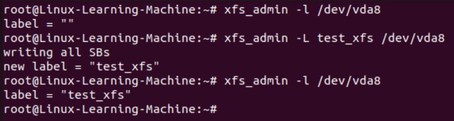  

tune2fs就是對應到使用EXT4的，指令如下
```
tune2fs [-l] [-L labelname] [-U UUID] devicename
```
這邊就不贅述了  

## 開機掛載  
上面是手動將目錄掛載上去，但是每次都要手動掛載很麻煩，因此這邊要說明如何在開機時自動掛載  
我們要去修改"/etc/fstab"這個檔案  
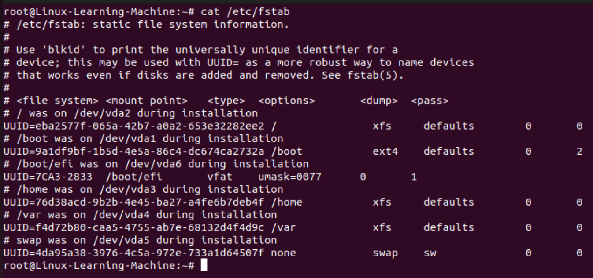  
這個檔案就是開機時自動掛載的順序，它將我們要mount指令所需的參數和一些其他參數寫在檔案中  
看上圖，每一條格式大約如下  
```
[devicename/label/UUID] [mount point] [filesystem] [filesystem parameters] [dump] [fsck]
```
前面三個很好理解，這邊就不贅述  
後面三個要說明一下  
1. filesystem parameters  
   這個是如果要mount的目錄有什麼特殊需求，可以寫在這一欄  
   例如: "-o codepage=950"這是在掛載時使用中文語系，或者rw之類的  
2. dump  
   這是一個備份的指令，決定這個檔案系統是否要備份  
   預設0表示不要備份  
3. fsck  
   filesystem check，開機時是否會去檢驗磁區，看看檔案系統是否完整  
   預設0表示不特別檢查  

這邊我們測試我們將我們上面創建的xfs系統寫在自動掛載內  
我們將我們的VM重開，可以看到，我們創建的/dev/vda8並沒有被掛載上去  
  
這邊我們進入"/etc/fstab"這個檔案並修改  
修改前如下  
  
我們在檔案後面加入我們的參數並存檔  
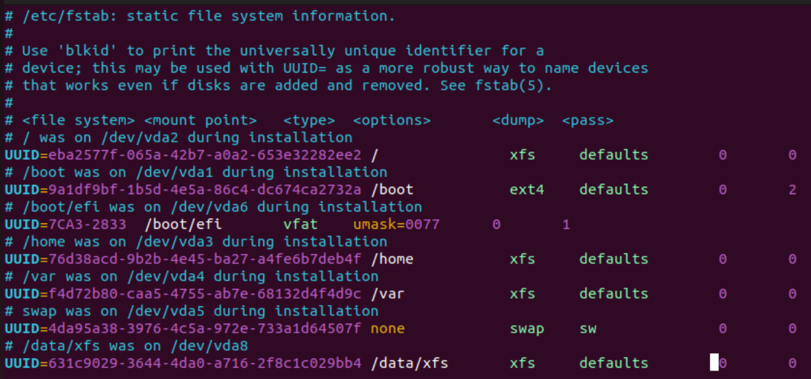  
我們可以用下面指令來將所有東西mount起來 
```
mount -a
```
  
可以看到我們的/data/xfs就被mount起來 
建議不要直接關機開機測試，因為如果這個檔案有問題，很有可能會導致開機出現問題  
所以建議用mount檢查  

"/etc/fstab"是設定檔，實際上filesystem的掛載是寫在"etc/mtab"和"proc/mounts"這兩個檔案內  
每次我們做掛載時會更動這兩個檔案，所以萬一真的寫錯導致無法開機，這時root可能會是唯讀狀態  
我們就得進入單人維護模式下前面講過的mount指令將其改為可寫  
```
mount -n -o remount,rw /
```

## 特殊裝置loop掛載  
loop裝置是linux講一個檔案做為一個磁碟裝置來使用  
將原本對磁碟的操作轉變成對檔案的操作，從而將檔案模擬成磁碟裝置  
這個可以解決磁碟分割不良等情況  
例如在一開始只做了一個root槽且沒有額外space可以進行分割，這時就可以用loop裝置來模擬磁碟槽  

這邊來實際測試看看，假設要在/srv底下建立一個512M的loopdev檔案  
先用"dd"這個指令來建立空檔案 (這個指令後面會介紹)  
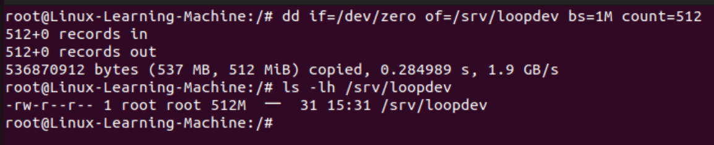  
可以看到，我們在/srv底下建立一個512M的loopdev檔案  
接著我們將這個檔案以XFS格式化  
因為這不是真的磁碟空間，所以要加上-f (force) 來強制格式化
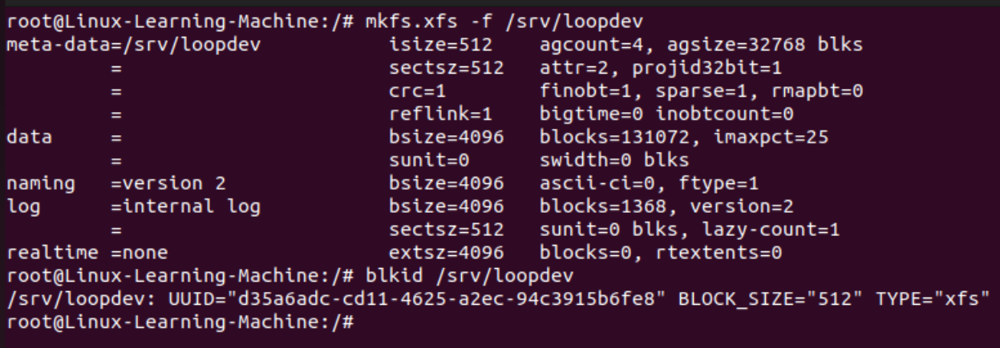  
這邊要注意，因為這實際上是個檔案，所以lsblk -f 是找不到他的  
格式化完之後，我們就將其掛載上去  
```
mount -o loop UUID=[] dirname
```
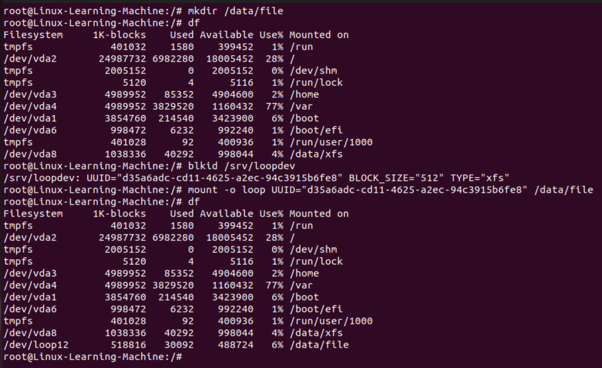  
可以看到這個檔案就被當作磁碟mount在系統上  
當然也可以像上面講的設定在開機時自動mount  
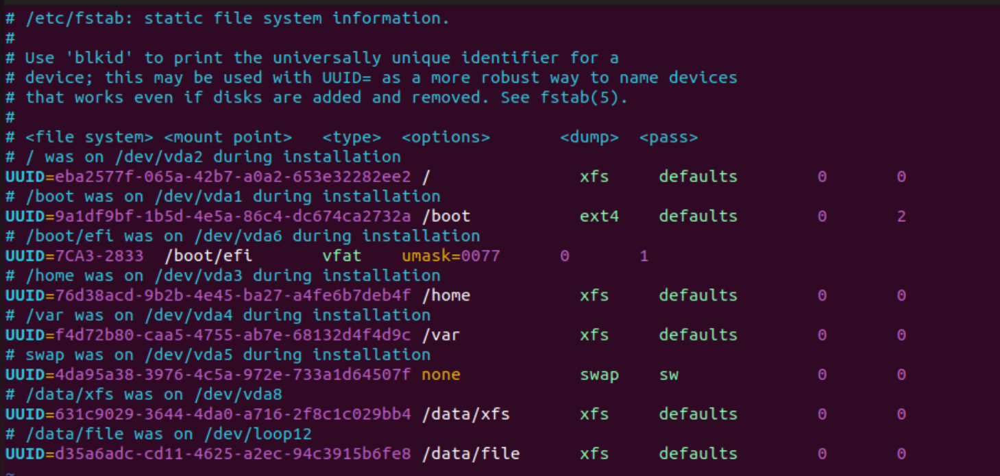  

## swap
swap空間是當記憶體不足的時候，會將disk當作緩衝，先將一部分的資料放進swap內，等到需要時在讀出來  
但現在絕大多數的電腦記憶體都是充足的，因此在個人使用上理論上不太會用到  
但以防萬一還是創建著備而不用比較好  
這邊用gdisk創建一個swap區塊 
```
gdisk /dev/vda
```
並用partprobe更新  
```
parprobe
```
接著用mkswap格式化  
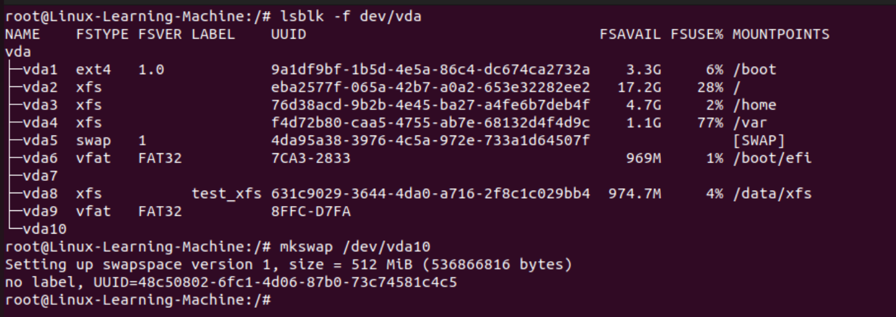  
但我們format完之後可以用"free"這個指令查看  
```
free [options]
```
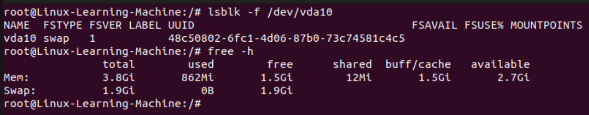  
會發現我們的swap並沒有增加，我們要透過swapon這個指令將剛剛格式化的空間加入進去  
```
swapon devicename
```
可以看到swapon後容量就增加了  
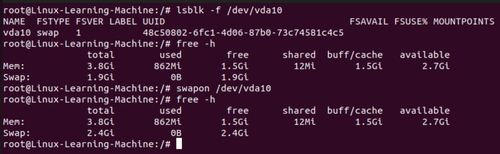  

可以用磁碟當作swap空間，也可以用上面所說的loop裝置作為swap空間  
如果我們今天要把swap空間拿掉，則可以透過swapoff指令  
```
swapoff devicename
```
  

## GNU parted進行分割
前面講的gdisk/fdisk分別是針對GPT和MBR的，但其實有個通用的指令就是parted  
```
parted devicename [指令 [parameters]]
```
不過因為這是通用的，所以有很多指令，加上現在絕大多數都是GPT，所以基本上用gdisk即可

## 壓縮/解壓縮
在電腦中所有檔案都是以bit方式來儲存，其實真正有用的資訊，是1的部份  
因此如果可以把非必要的資訊剔除，就可以把檔案大小變小，也就是所謂的壓縮  
而當把壓縮的檔案變回成原本的檔案，則稱為解壓縮  
壓縮前和壓縮後的大小差異則稱為壓縮比  

接著就來介紹linux常用的壓縮指令 
### gzip  
gzip可以用來解壓縮compress, zip和gzip的壓縮檔  
指令如下  
```
gzip [options] filename
```
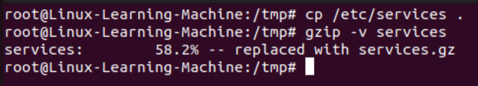  
先把/etc/services copy到/tmp中然後壓縮  
這邊-v是顯示壓縮比 
使用gzip要注意，用gzip壓縮後原檔會不見，只保留.gz檔 

這邊要提一下zcat/zmore/zless/zgrep  
一般我們要用cat/more/less/grep需要是原檔，但每次都要解壓縮很麻煩，因此就有了這些指令  
這四個指令是只能用在gzip的壓縮檔 
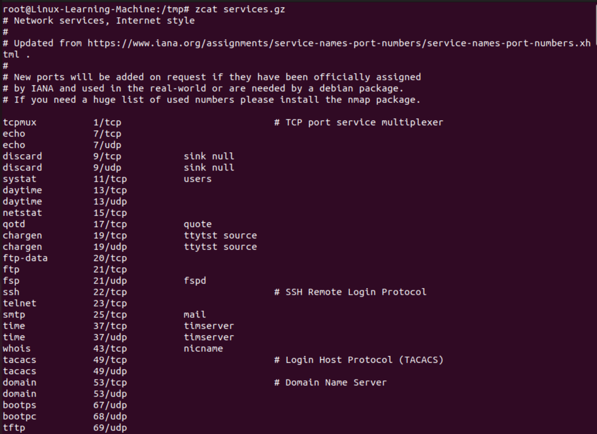  
要解壓縮的話也是gzip這個指令  
```
gzip -d filename
```
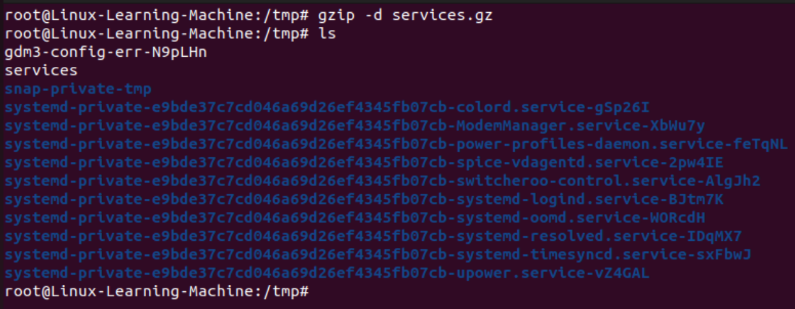  

### bzip2
gzip一開始設計是為了取代compress，而bzip2則是為了取代gzip  
bzip2的用法幾乎和gzip相同  
```
bzip2 [options] filename
```
而bzcat/bzmore/bzless/bzgrep則是對應到zcat/zmore/zless/zgrep  
這邊就不贅述了  

### xz
xz是開發者還不滿足bzip2的壓縮比，就又推出了xz  
用法也和上面幾乎一樣 
```
xz [options] filename
```
而xzcat/xzmore/xzless/xzgrep則對應到其他指令  

## 打包
前面三個指令都是壓縮單一檔案，它雖然也可以壓縮目錄，但會是對所有目錄內所有檔案分別壓縮  
而打包則是把一個目錄內的所有東西變成一個檔案  
\*打包和壓縮的差別是打包只是變成一個檔案，大小完全不變  
\*很多人會誤解打包是壓縮，是因為現在絕大多數的打包指令內部會同時進行壓縮  

### tar
tar就是linux的打包指令之一，指令如下 
[-z|-j|-J]是要用哪種壓縮，z: gzip, j: bzip2, J: xz  
-C是要指定目錄
```
tar [-z|-j|-J] [-c/options] -f filename dirname         //壓縮
tar [-z|-j|-J] [-t/options] -f filename                 //查看內部檔名 (filename要是壓縮檔)
tar [-z|-j|-J] [-x/options] -f filename [-C dirname]    //解壓縮
```
這邊去模擬備份/etc這個資料夾來練習  
這邊注意，有家一個選項-p，這個意思是preserve permissions 
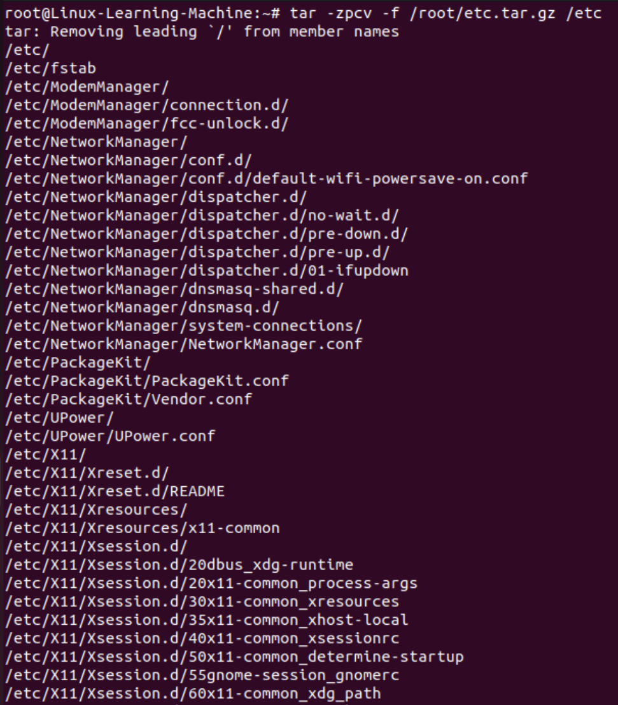  
可以看到壓縮前檔案大約13MB，壓縮後剩1.3MB  
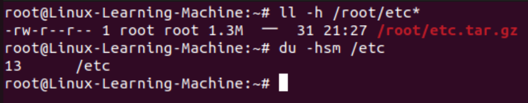  

\* 這邊特別提一下，如果只有打包沒有壓縮，副檔名會只有.tar，這種檔案稱為tarfile  
\* 如果是打包+壓縮，副檔名會是.tar.gz之類的，這種檔案稱為tarball  

## XFS檔案系統備份和還原
### xfsdump
xfsdump是XFS的檔案系統的備份功能指令  
它除了可以full backup外，還可以incremental backup  
\* Incremental backup是備份完後若過一段時間檔案系統內的檔案有更新，它會只紀錄和上次不同的部份  

在xfsdump第一次備份會是完整的備份，此完整備份被定義為level 0  
xfsdump使用上有以下限制  
1. xfsdump只能備份以掛載的檔案系統  
2. xfsdump需要root權限才能操作  
3. xfsdump只能用在XFS filesystem  
4. 只有xfsrestore能解析xfsdump備份下來的資料 (xfsrestore後面會講)  
5. xfsdump是用UUID來辨識備份檔案  

\* xfsdump在ubuntu內並沒有預先安裝，要先安裝才能使用  

備份指令如下  
其實xfsdump還有很多options，這邊只提比較常用到的  
```
xfsdump [-L S_label] [-M M_label] [-l num] [-f dumpfilename] filename/dirname
// -L session label，像是git commit的備註，讓人辨識這次任務是什麼  
// -M media label，在早期還是用磁帶的時候，一個備份可能被拆成多個磁帶，人可能會忘記哪些磁帶才是正確的
//                 所以這個是給xfsrestore看的label，現今幾乎都是用磁碟或ssd，就相對比較不重要  
// -l level，就是前面講的level (0 ~ 9)  
// -f 就是要備份成的檔名
```
這邊我們以備份home來做練習，備份到/srv底下  
因為是第一次備份，所以是level 0，並幫他上label   
備份完後可以看到/srv/home.dump出現  
下面那個/var/lib/xfsdump/inventory是要有備份過東西才會出現的資料夾和其檔案  
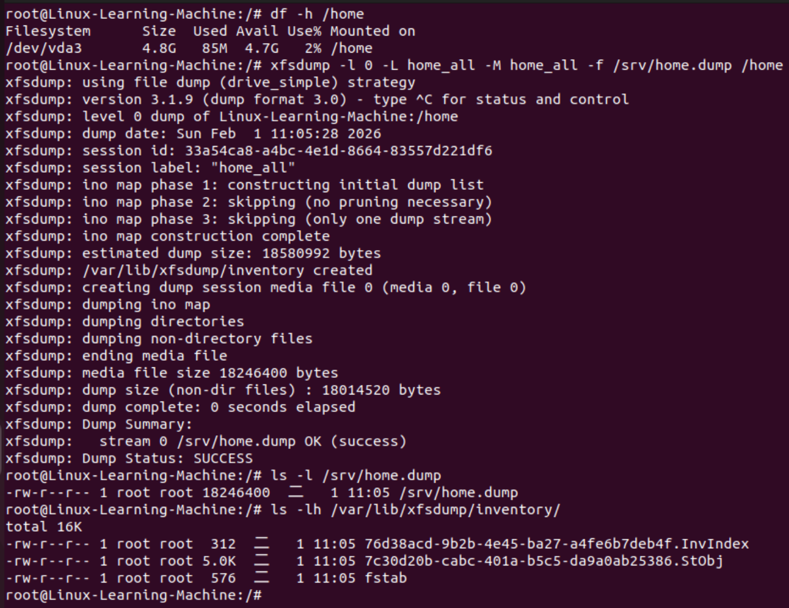  

xfsdump的查看指令如下  
```
xfsdump -I
```
可以看到只有一個session 0 (因為只執行一次) level 0，label也是我們輸入的  
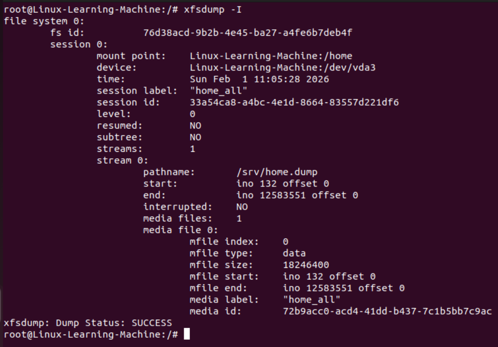  
接著練習一下incremental bakup  
在home內寫入一個10M的檔案  
因為檔案有差異，所以用level 1 
可以看到新的dump檔案只有大約10MB (因為只備份了差異部份)  
另外用不同的level的時候，檔名不能完全一樣，因為這樣會破壞掉xfsdump的link無法比較差異  
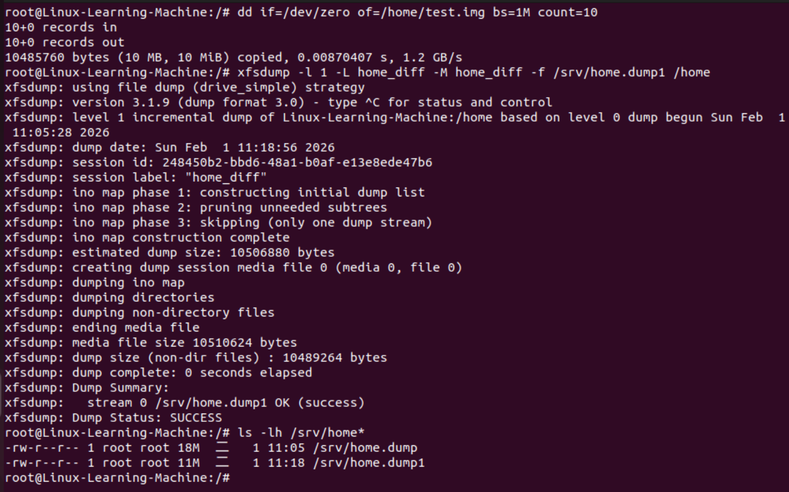  
再次查看 
可以看到多了一個session 1
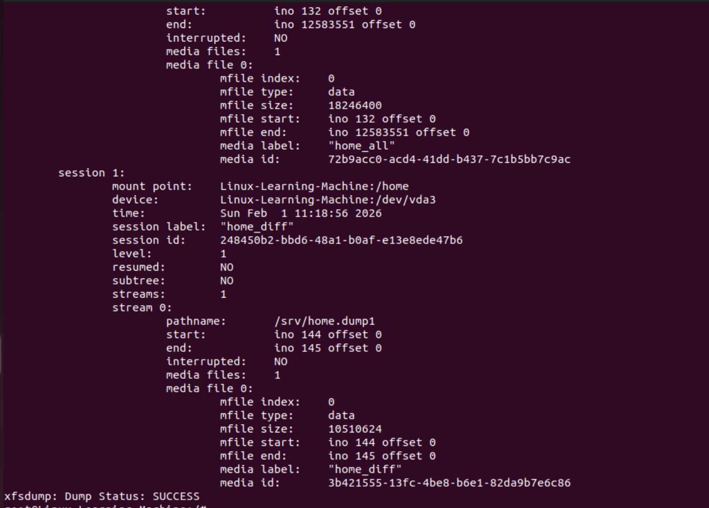  

### xfsrestore 
這個是xfs的備份還原指令  
指令大致如，和xfsdump差不多  
```
xfsrestore -f dumpfilename [options] dirname
```
這邊我們做兩次還原level 0的備份，一個是在原本的home，另一個是在/tmp底下創建一個home目錄  
會發現兩邊還原一樣的檔案，但大小不一樣，這是因為我們有在home寫入10M的檔案  
還原它只會把相同檔名的檔案蓋掉，並不會把還在原資料夾的檔案刪除  
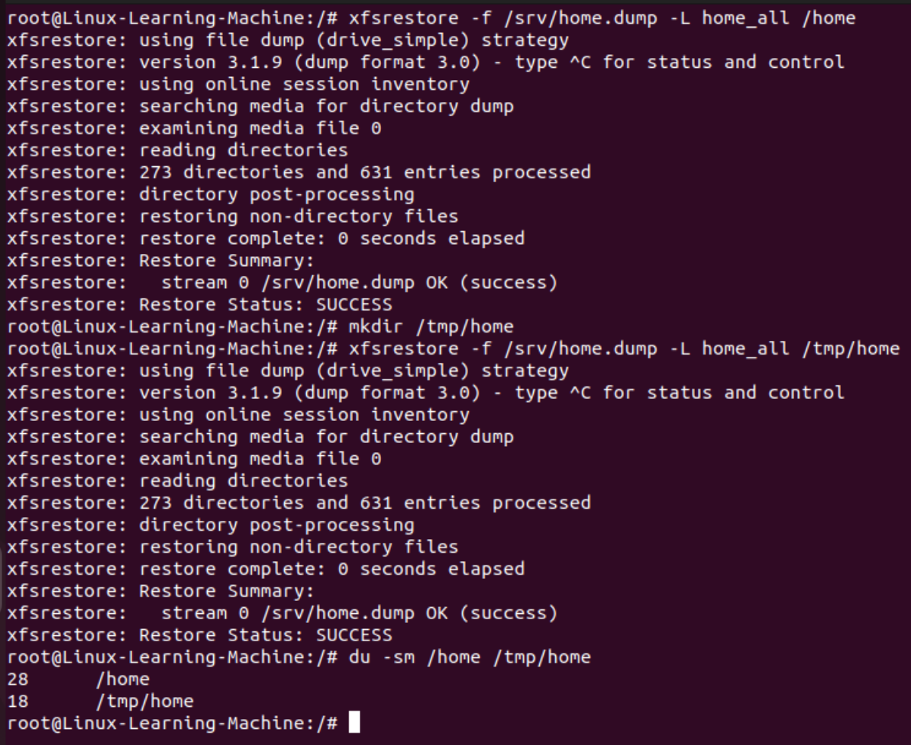  
如果要復原incremental bakup，就得一層一層來，先復原0 -> 1 -> 2 -> ...  
這邊要比較特別介紹一下xfsrestore的-i這個option  
-i是interactive的意思，它會進入一個互動界面  
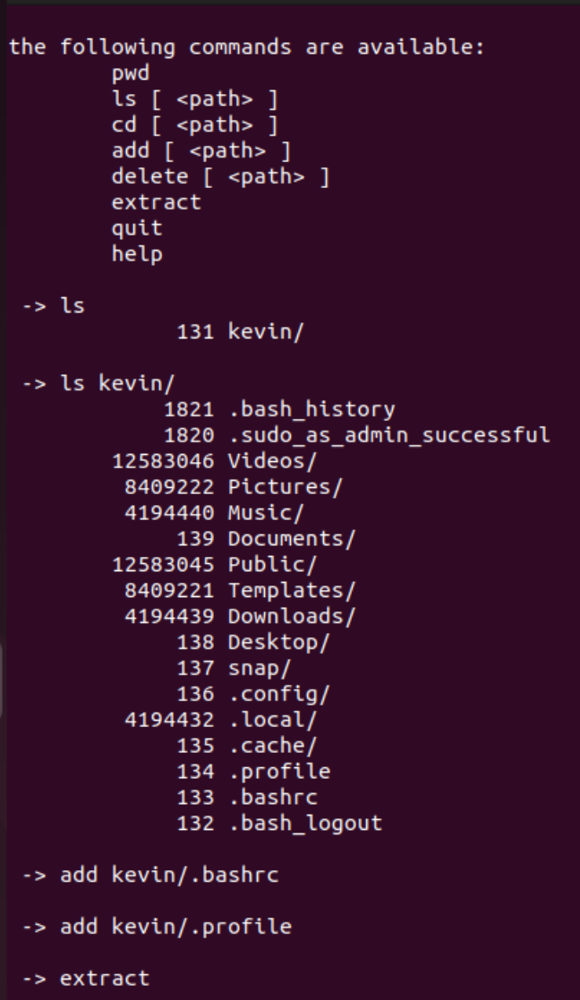  
可以看到我只選擇還原兩個檔案，此資料夾內就只有這兩個檔案被我還原  
在這個互動界面，我們可以查看這個備份檔裡有哪些檔案，還可以只還原某些檔案  
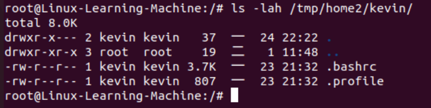  

## 其他常用的備份工具
### dd
這個指令我們前面有用過，乍看之下像是cp複製檔案的指令，但其實dd最常用的功能是備份  
dd和cp最大的差別是，cp是在檔案系統層面去複製檔案，而dd是讀取整個磁碟or裝置變成一個檔案  
因為dd是讀取整個裝置，所以常被用來最備份功能  
```
dd if=input_filename of=output_filename bs=block_size count=number
// if: input file (可以是裝置)  
// of: output file (可以是裝置)  
// bs: block size (預設512bytes) 
// count: block number  
```
例如 (把/dev/vda2備份一份到/tmp底下，因為這個裝置有18G，需要花一些時間)  
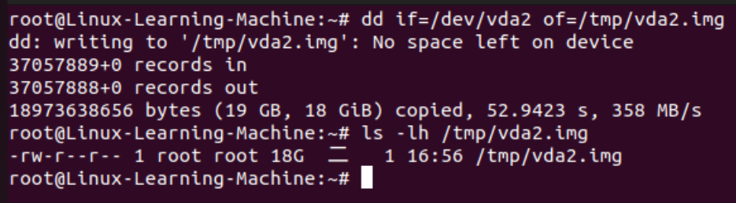  
\* 因為dd是把整個裝置讀出來變成一個檔案，所以output file會和原本的磁碟一樣大，但他不care檔案系統  
### cpio
cpio是個特殊的指令，像是dd或是xfsdump都可以指定input或output，但是cpio不行，所以經常搭配find使用  
cpio和tar有點像，是一個打包令  
```
cpio -ovcB > filename/devicename    // 備份  
cpio -ivcdu < filename/devicename   // 還原  
cpio -ivct < filename/devicename    // 查看  
```
選項有點多，這邊就不一一介紹  
我們嘗試備份一下/boot底下所有檔案  
這邊要注意，我們要先進入要轉換目錄，在輸入相對路徑，而且***一對要是相對路徑***  
這是因為如果用絕對路徑，到時候cpio在還原的時候，也會是絕對路徑，就會把原本的東西蓋掉  
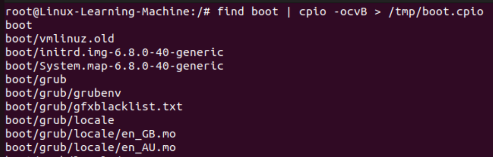  
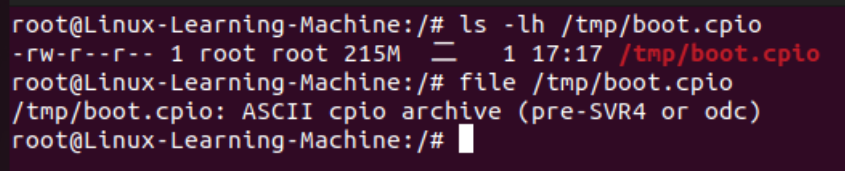  
接著在/root底下把它解開  
在和原本比較可以看到兩個資料夾內東西是一樣的  
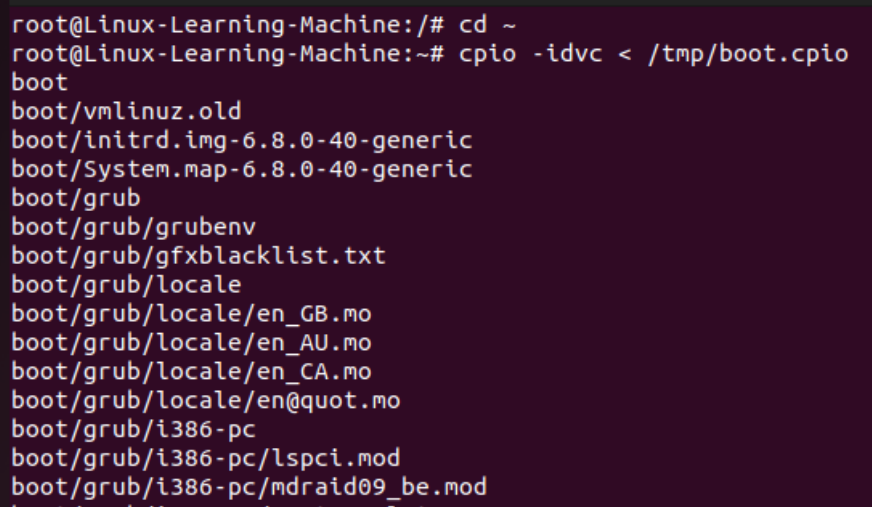  
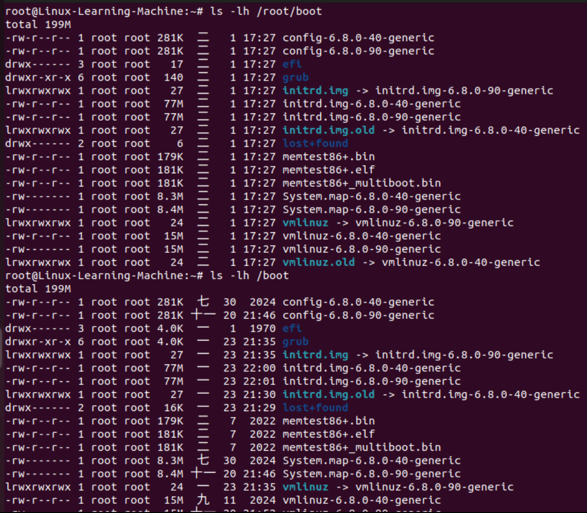  
