# Ubunntu VM installation
## Install KVM on linux
1. 檢查電腦是否支援虛擬化，若> 0表示支援  
   vmx: Intel cpu, svm: AMD cpu
   ```
   egrep -c '(vmx|svm)' /proc/cpuinfo
   ```
   
2. 安裝所需套件  
   1) qemu-kvm: 虛擬化核心  
   2) libvirt: VM管理服務  
   3) virt-manager: GUI管理工具  
   4) bridge-utils: 網路橋接 (若有需要)
   ```
   sudo apt update
   sudo apt install -y \
     qemu-kvm \
     libvirt-daemon-system \
     libvirt-clients \
     bridge-utils \
     virt-manager
   ```
3. 確認libvirt是否為active  
   ```
   sudo systemctl enable --now libvirtd
   systemctl status libvirtd
   ```
   
4. 將使用者加入群組  
   ```
   sudo usermod -aG libvirt,kvm $USER
   ```
5. 確認KVM是否正常   
   ```
   kvm-ok
   ```
   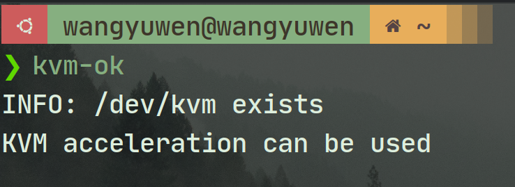

## 創建VM
創建虛擬機，接下來除了硬碟大小設成60G和勾選和安裝前自訂配置外，沒什麼特別需要注意的 (預設的ram和CPU足夠)  
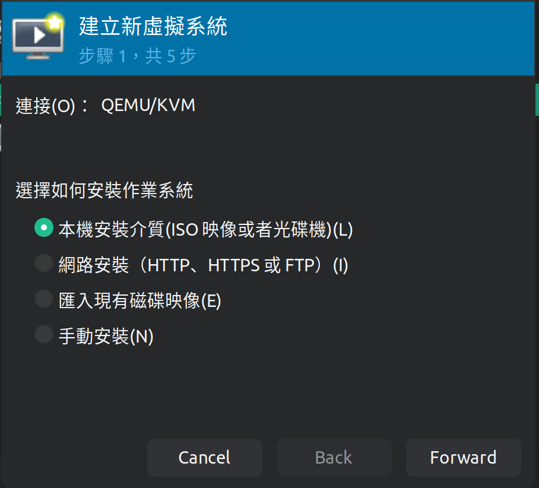
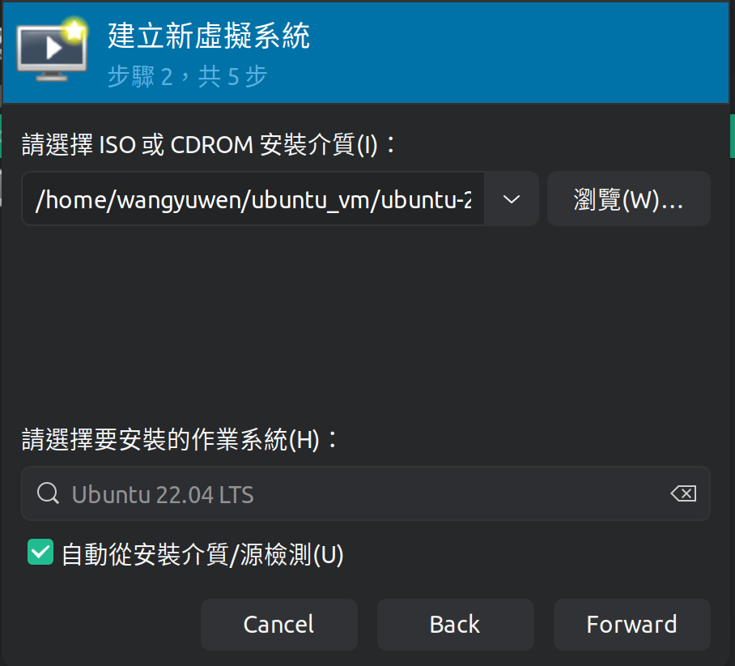
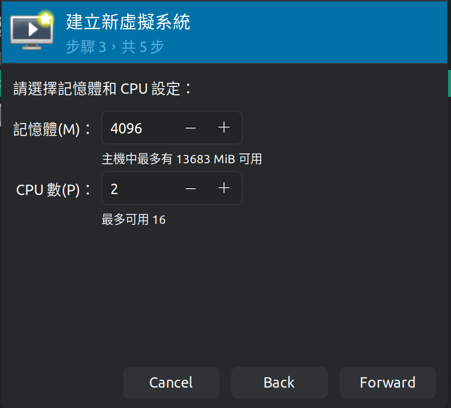
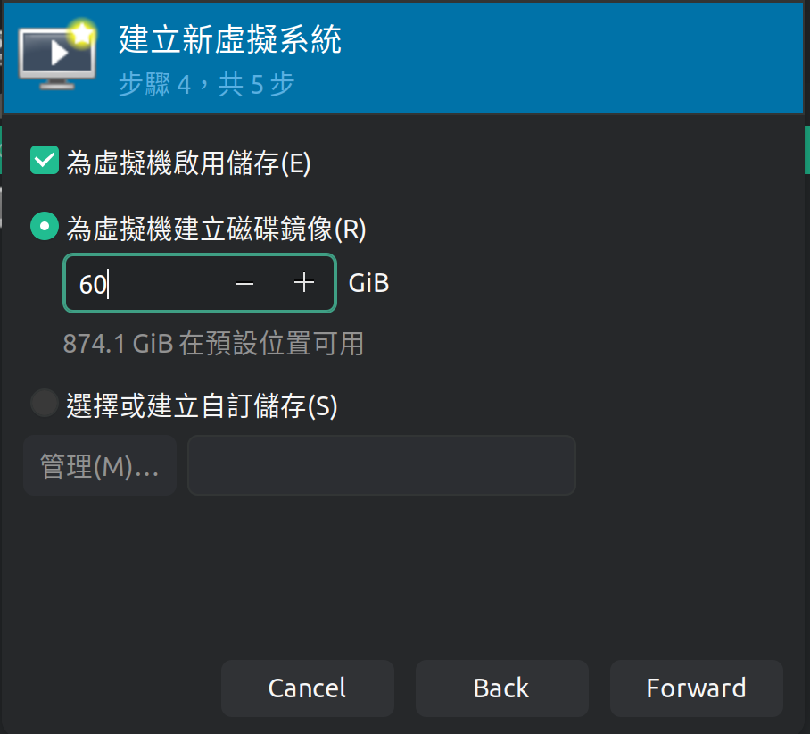
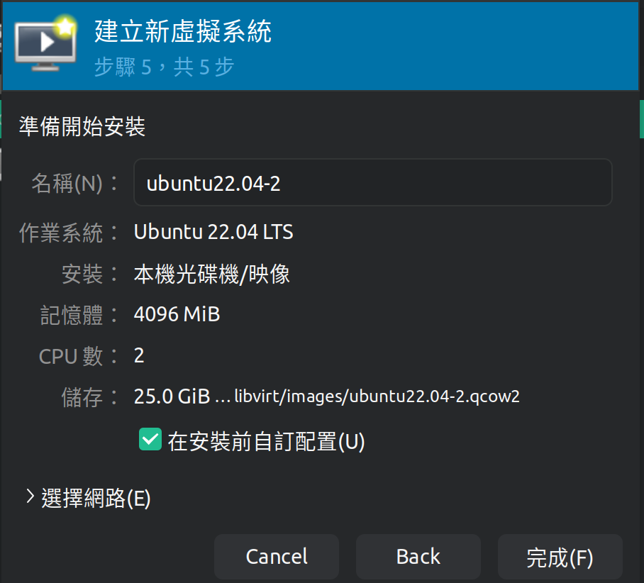

## Ubuntu 22.04 LTS installation step by step
1. 初始安裝界面 (選第一個)  
   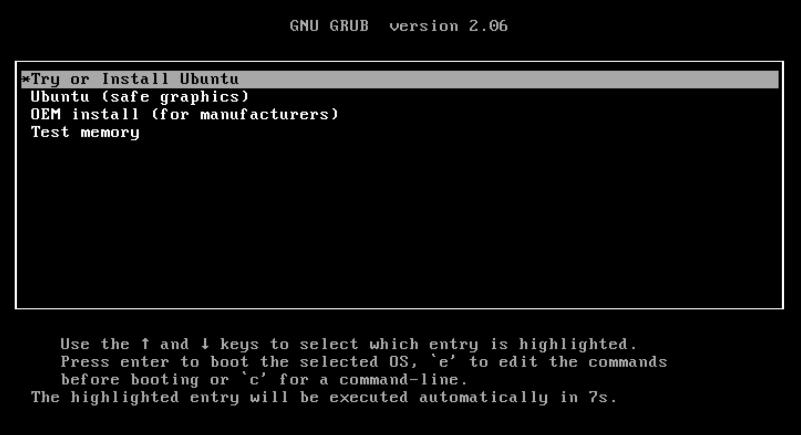  
2. 安裝界面 (選INstall Ubuntu)  
   
3. 選擇鍵盤鍵位 (看個人習慣)  
   
4. 選GUI (normal installation)和更新及安裝第三方軟體 (照下圖勾選)  
   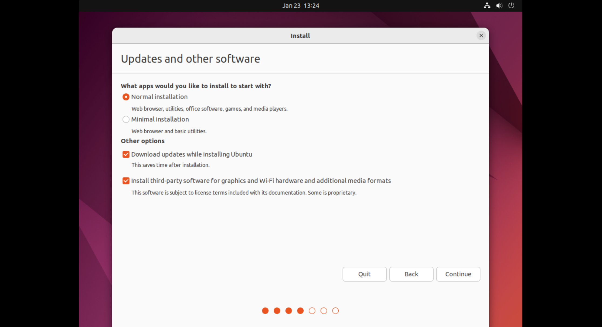
5. 分割硬碟槽 (重要)  
   選something else (手動配置分割磁碟槽)  
   掛載root (/)，root大小最好超過25G (現在ubuntu有點肥預裝了很多東西)  
   安裝的時候最好預留一些空間不要進行分割 (以後重灌或什麼較方便備份)  
   現在此方法是標準分割，LVM的作法之後在說明  
   配置如下:  
   1) /boot 4G  ext4  
   2) /     25G xfs  
   3) /home 5G  xfs  
   4) /var  5G  xfs  
   5) Swap  2G  swap 
   6) EFI   1G  EFI  
   7) Resverved Bios Boot 5M Revserved BIOS boot area
   
   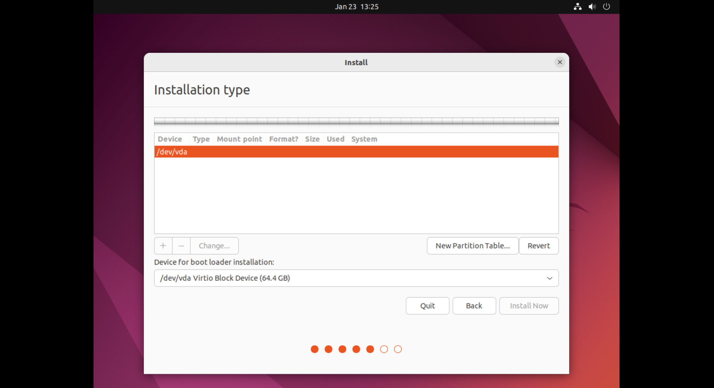
   
   
   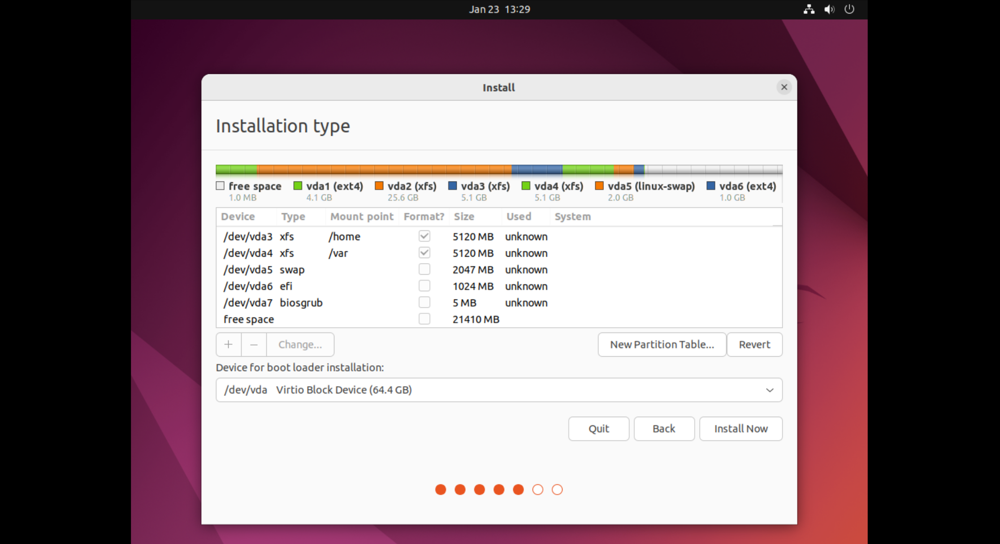
6. 選地區 (看個人使用)  
   
7. 使用者設定 (個人設定)  
   忘了截圖XD  
8. 等待安裝完成  
   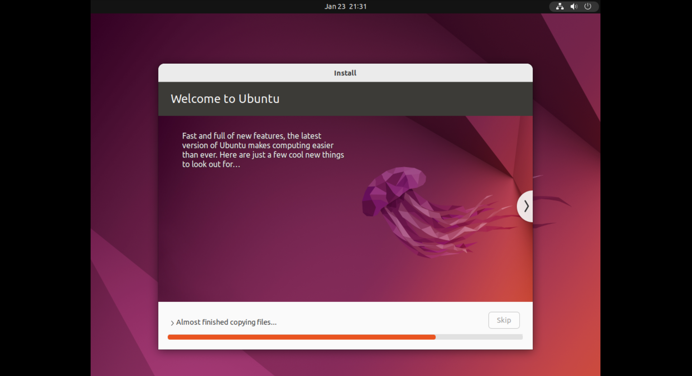

