# Regular Expression
正規表示式是一種描述字串規則的語言，利用這些特殊的規則來讓使用者精準找到符合條件的東西  
\* 正規表示式是一種非常強大的語法，但並不是所有工具都支援，像是cp等就不支援  

## 語系問題
因為不同的語系對於不同的char會是不同的排列順序，因此在有些操作上結果會不同  
例如C語系和zh_TH.big5這兩個的語系排列  
```
LANG=C    : 0 1 2 3 4 ... A B C D ... Z a b c d ... z
LANG=zh_TW: 0 1 2 3 4 ... a A b B ............... z Z
```
因此以上面的例子如果去判斷是否在[A-Z]之間就會有不同的結果  
因為POSIX的標準是用C語系，所以在練習的時候建議先將語系轉換成C語系  
```
export LANG=C; export LC_ALL=C
```

此外為了盡可能避免語系的問題，regular expression有設定一些特殊符號，來避免問題和方便使用  
| 符號 | 代表意義 |
| ---- | -------- |
| [:alnum:] | 所有英文char和數字，即0-9, A-Z和a-z |
| [:alpha:] | 所有英文char，即A-Z和a-z |
| [:digit:] | 代表數字，即0-9 |
| [:lower:] | 代表所有小寫英文char，即a-z |
| [:upper:] | 代表所有大寫英文char，即A-Z |
| [:blank:] | 代表空白和[Tab]兩者 |
| [:cntrl:] | 代表鍵盤上的控制按鍵，例如CR, LF, Del, Tab, ... |
| [:graph:] | 代表除了空白和[Tab]之外的所有按鍵 |
| [:space:] | 代表所有會產生空白的char，包過[space], [Tab], CR, ... |
| [:print:] | 代表任何可以被print出來的char |
| [:punct:] | 代表所有標點符號(punctuation symbol) |
| [:xdigit:] | 表示能表示16進位數字的char，即0-9, A-F和a-f |

## 基礎語法
下面的練習會搭配grep這個指令來練習  
grep這個指令建議先設定成會把關鍵字自動上色 (ubuntu有預設將其設在alias中)

這邊使用vim先創建練習的檔案    
```
vim regular_express.txt
```
txt內容如下
```
"Open Source" is a good mechanism to develop programs.
apple is my favorite food.
Football game is not use feet only.
this dress doesn't fit me.
However, this dress is about $ 3183 dollars.^M
GNU is free air not free beer.^M
Her hair is very beauty.^M
I can't finish the test.^M
Oh! The soup taste good.^M
motorcycle is cheap than car.
This window is clear.
the symbol '*' is represented as start.
Oh!     My god!
The gd software is a library for drafting programs.^M
You are the best is mean you are the no. 1.
The world <Happy> is the same with "glad".
I like dog.
google is the best tools for search keyword.
goooooogle yes!
go! go! Let's go.
# I am VBird

```

### 特定字串
搭配grep搜尋特定的字串指令一個一個來介紹
1. 有包含特定字串的部份 (有分大小寫)  
   ```
   grep -n '字串' filename
   ```
   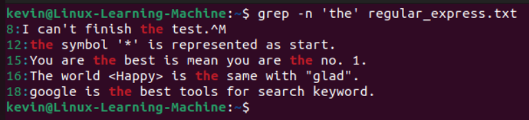  
2. 有包含特定字串的部份 (不分大小寫)  
   ```
   grep -in '字串' filename
   ```
     
3. 不包含特定字串的部份 (有分大小寫)  
   ```
   grep -vn '字串' filename
   ```
     

### [] 搜尋集合
[]可以用來表示一個集合，因為在有些情況下，我們並不是只要搜尋特定的詞，這種時候可以用集合來表示  
\* []當中不管有多少個char，他在regular express上都只代表一個char  

這邊來看幾個範例  
1. 在文件中，假設我們想找包含"test"和"taste"的部份，我們可以看到他們符合"t.st"這個pattern  
   因此我們可以這樣找，[]的意思是在這個位置只要是a or e都可以  
   ```
   grep -n 't[ae]st' regular_express.txt
   ```
   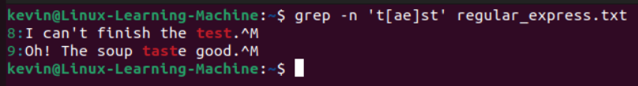  
2. 可以找到符合字元的，當然也可以是排除某些字元  
   例如我想要找"oo"這個字元但"oo"前不能是g，例如google就不符合我們要的條件  
   可以利用"^"來取反
   ```
   grep -n '[^g]oo' regular_express.txt
   ```
   下面這張圖片，我們先秀出符合"oo"這個條件的在秀出"[^g]oo"的  
     
3. 但假設範圍很大，我們要一個一個把char打入[]中顯然是個麻煩的事，因此可以直接用區間表示  
   例入下面兩個範例，一個代表所有數字，一個代表不能是小寫char  
   ```
   grep -n '[0-9]' regular_express.txt
   grep -n '[^a-z]oo' regular_express.txt
   ```
   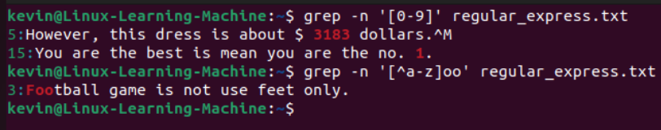  
4. 也可以在裡面用在前面所說的特殊符號來搭配使用  
   ```
   grep -n '[[:digit:]]' regular_express.txt
   grep -n '[^[:lower:]]oo' regular_express.txt
   ```
   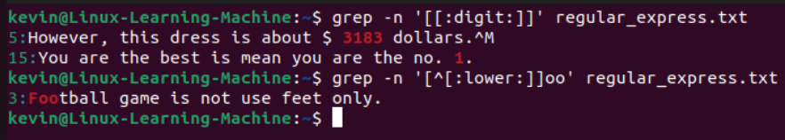  

### 行首(^) 和 行尾($)
在上面的例子中，若在集合裡，"^"代表取反，但在外面的話怎有不同的意思  
"^": 每行的最開頭  
"$": 每行的結尾  

一樣來看一些範例  
1. 例如想找以小寫為開頭的部份  
   ```
   grep -n '^[[:lower:]]' regular_express.txt
   ```
   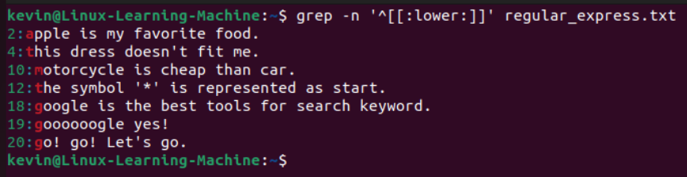  
2. 假設想要找到以"."為結尾的部份  
   這邊要特別注意"."前面需要加一個"\"這是因為"."在regular expression代表著任何一個char  
   因為是特殊字元，因此若是真的要找"."就要在前面加"\"  
   ```
   grep -n '\.$' regular_express.txt
   ```
   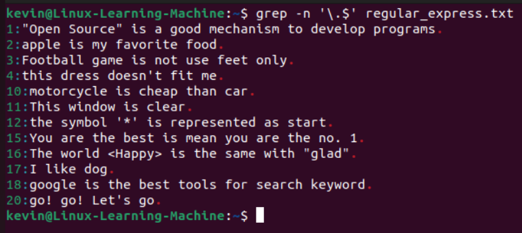  
3. 知道可以找到行首和行尾，那假設我們要找到一個空行，也可以利用這兩個符號  
   因為"^$"代表著行首緊接著行尾  
   ```
   grep -n '^$' regular_express.txt
   ```
   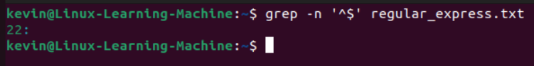  

### 任意一個字元(.) 和 重複字元(\*)
在一般的bash中，"\*"代表著萬用字元，代表"\*"可以是任何char和空char  
但在regular expression中，"\*"代表著是重複字元，意思是在"\*"的前一個char可以重複0 ~ n次  
而"."前面我們有提過，它可以代表任意一個字元  

來看幾個範例  
1. 假設我要找尋符合"g..d" pattern的部份  
   下面這個例子就可以在文章中找到"good"和"glad"兩種  
   ```
   grep -n 'g..d' regular_express.txt
   ```
   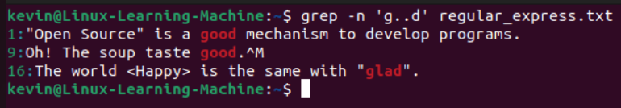  
2. 假設我要找尋字串要符號以g為這個詞開頭和結尾且中間至少要一個o的字，例如gog, goog, ...  
   就可以用到"\*"  
   ```
   grep -n 'goo*g' regular_express.txt
   ```
   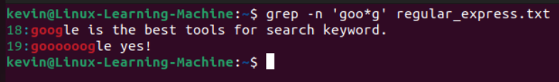  
3. 如果將"."和"\*"搭配使用，就代表著可以是任意東西  
   以下面這個範例，只要有以g開頭和以g結尾即可  
   ```
   grep -n 'g.*g' regular_express.txt
   ```
   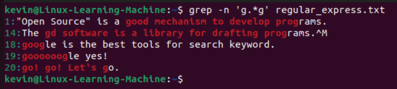  

### 限定重複次數{}
上面我們講了可以用"\*"重複0 ~ n次，但如果我們只想重複特定次數呢  
這種時候就可以用到"{}"，它可以做到只重複特定或是一個range的次數，而不像"\*"可以是任意次數  
要注意，再大括號符號的前面都要加上"\"  

範例  
1. 重複特定次數  
   假設我只限定只能重複兩次  
   ```
   grep -n 'o\{2\}' regular_express.txt
   ```
   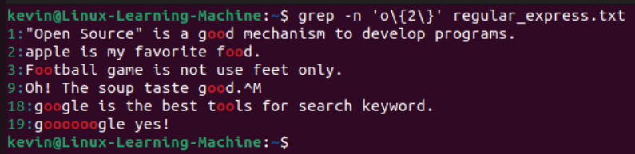  
2. 重複range  
   例如我要重複2 ~ 5次的  
   ```
   grep -n 'go\{2,5\}g' regular_express.txt
   ```
   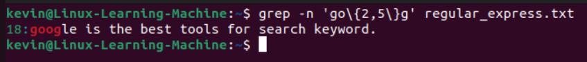  
3. 重複 >= 某個特定次數  
   例如重複 >= 2次都找  
   ```
   grep -n 'go\{2,\}g' regular_express.txt
   ```
   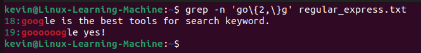  

## 延伸語法
延伸語法其實是把一堆基礎語法合在一起簡化而成  
像是有的時候要搜尋多種不同的pattern，在基礎語法可能會要寫很長一串或是多個指令來找  
而延伸語法就是把這些多個指令進行簡化而來的  

grep在使用這些延伸語法要是用"grep -e"這個options  
但像是Ubunut已經把"grep -e"給取別名為"egrep"，因此後面練習就會直接使用"egrep"  

延伸語法符號   
1. "+"  
   代表著重複1個 or 1個以上的重複char，等價於"cc\*" (下面用c代表重複的char)  
   ```
   egrep -n 'go+d' regular_express.txt
   ```
   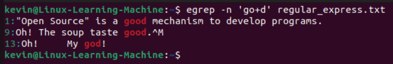  
2. "?"  
   代表重複0個 or 1個的重複char，等價於"c\\{,1\\}" (下面用c代表重複的char)  
   ```
   egrep -n 'go?d' regular_express.txt
   ```
   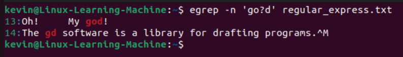  
3. "|"  
   or，跟我們認知的or是一樣的東西  
   ```
   egrep -n 'gd|good|dog' regular_express.txt
   ```
   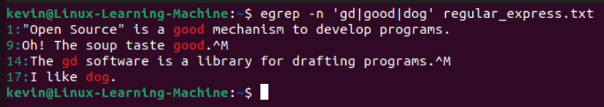  
4. "()"  
   群組的概念  
   ```
   egrep -n 'g(la|oo)d' regular_express.txt
   ```
   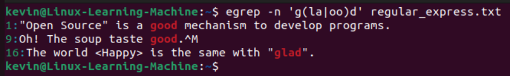  
5. "()+"  
   其實就是上面的4 + 1，讓群組重複1次以上的組合  
