# Shell
Shell是一種持續互動式的應用程式，它介於user和kernel之間，這個應用程式讓使用者去執行其他程式  

\* 我們平常在用的terminal裡面預設執行程式的程式就是shell 

Shell有非常多種，bash, zsh, c shell, ... 而linux預設是使用bash  
每一個使用者在登入時，linux會預設配置一個shell，它被寫在/etc/passwd內  
最後面就是每個帳號等預設的shell  
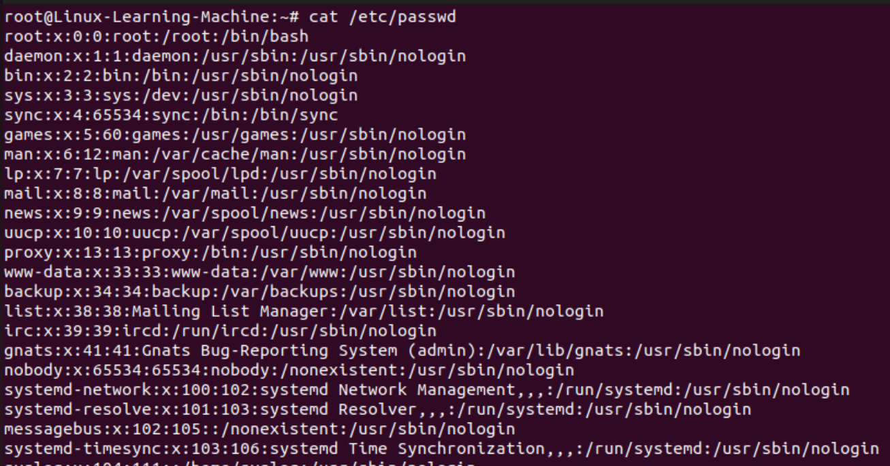  

## bash
bash有有很多優點  
1. history  
   當我們在linux下的指令會被存在RAM裡面，因此當我們按方向鍵上下，可以看到之間下過得指令  
   指令被存在RAM裡面是在這次登入內，但如果我們登出的時候，linux會把RAM裡面的紀錄寫入.bash_history  
   之後我們下次登入時，還是可以找到history的指令  

2. 補全  
   就是我們不把指令或檔名打完整，而按兩下tab，bash會自動找出符合目前的指令或檔名  
   若只有一個符合條件，則會直接補齊  

3. alias  
   取別名，若有一些常用的指令，且指令冗長，可以透過取別名的方式來縮短  
   就像ubuntu預設會把"ls -alF"取名成"ll"  

4. 工作控制和前景背景控制  
   像是可以把工作放到背景去執行  

5. shell script  
   可以把一堆指令寫成一個檔案，該檔案可以透過互動讓主機進行偵測工作  

6. Wildcard  
   bash可以用像是\*等formal language的字元來搜尋符合條件的東西  

### type  
type是一個bash內建的指令，這個指令是用來確認，指令的來源 (例如可以確認是否是bash內建的指令)  
```
type [options] name
```
例入我們可以查看一下ls這個指令  
ls這個指令有三個來源，會先使用最上面的那個  
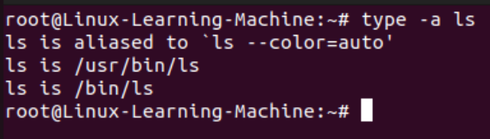  
接著我們可以查看像是cd, type指令  
可以看到是屬於bash內部的指令  
  

## Shell 變數
shell可以把一些會變動或複雜的東西變成變數，這樣就可以讓shell自動根據使用者讀取，而不用把一個程式寫死  

而當中有一些變數會去影響到linux的環境，稱之為環境變數，例如PATH會決定我可以決定我能執行哪些指令  
在shell中，我們要使用變數要在前面加一個$  
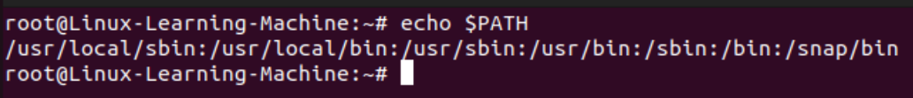  
如果我們使用了沒有事先設定過得變數，bash預設會是空的，不會有任何東西  
例如  
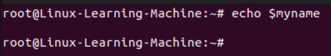  
上面像是PATH是系統預設的變數，但我們也可以自己設定變數，設定變數有以下規則  
1. 要用"="來連接  
   ```
   myname=test
   ```   
2. "="兩邊不能用空白  
   ```
   myname = test    // error
   ```  
3. 變數只能是英文和數字，但不可以數字開頭  
4. 變數內若有空白，可以用"或'包起來  
   " 可以包含變數，例如  
   ```
   myname=test
   var="my name is $myname"
   echo $var       // 會顯示出my name is test
   ```
   ' 則會是完全純文字  
   ```
   myname=test
   var='my name is $myname'
   echo $var       // 會顯示出my name is $myname
   ```
5. 可以用跳脫字元(\\)來表示空白, $等特殊字元  
   ```
   myname=test\ test
   echo $myname    // test test
   ```
6. 使用`指令`或$(指令)可以讓其先執行裡面的指令  
   ```
   echo `uname -r`
   echo $(uname -r)
   // 會印出版本號  
   ```
7. 若要擴增變數內容，可以用"$變數"或${變數}後面加上要擴增內容  
   ```
   myname=test
   myname="$myname"test   // testtest
   myname=${myname}test   // testtest
   ```
8. 可以透過export這個指令來把變數變成環境變數  
   ```
   export myname
   ```
9. 可以用unset這個指令來取消變數  
   ```
   unset myname
   ```

前面有提到環境變數，那要怎麼才能知道目前的環境下有哪些環境變數呢  
答案是可以透過env這個指令來查看有哪些環境變數  
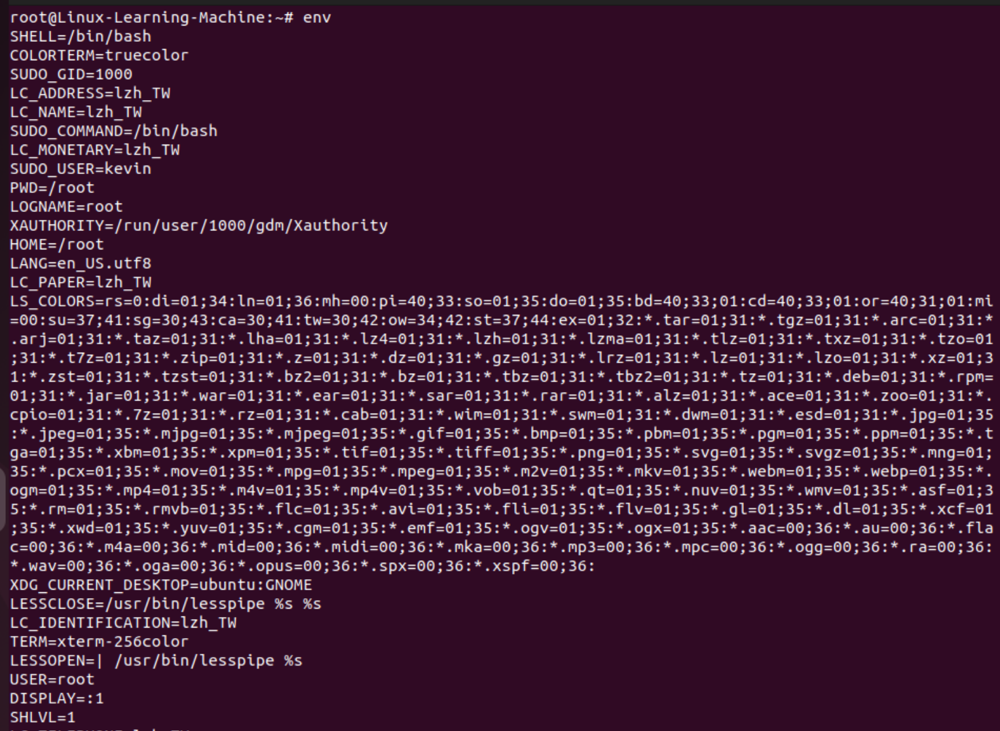  
如我要查看所有變數，這可以用set這個指令 (不過set會列出所有變數, 函數和shell的設定)  
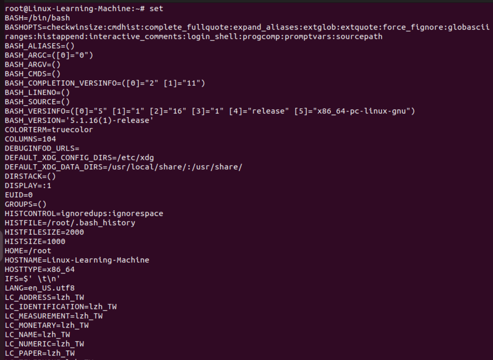  

乍看之下環境變數和自訂變數，好像功能上差不多，但其實在child process中是讀不到parent的自訂變數  
例如  
```
myname=test   // 設定自訂變數
bash          // 開啟並進入child process
echo $myname  // 不會show出任何東西
```
Child process只能讀到環境變數  
為了解決這個問題就需要export這個指令，來將自訂變數變成環境變數  
```
export variablename
```
例如  
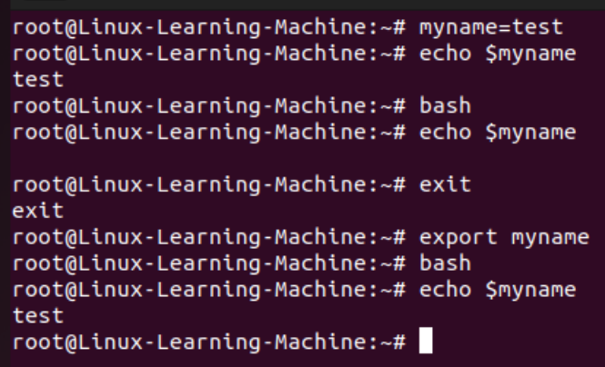  

相信各位在使用linux安裝東西時，會遇過要使用者輸入yes/no的情況，這個是將某個變數讓使用者鍵盤輸入  
而這個指令就是read  
```
read [-pt] variablename
// -p: 可以接提示字串  
// -t: 接秒數，讓這個不會無限等待  
```
  

還有指令是可以指定變數的data type，就是指令declare/typeset (這兩個指令是一樣的功能)  
```
delcare [-aixr] variablename
// -a: array
// -i: integer  
// -x: export (和export指令功能相同)  
// -r readonly，不可被更改也不能unset，若不小心設成唯讀，需要先登出才能復原  
```
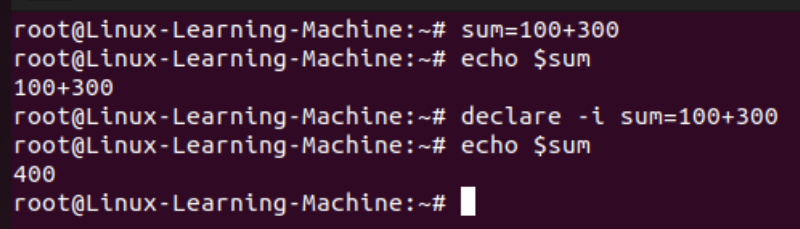  

宣告array除了可以用delcare，也可以直接宣告，基本上就和平常寫程式差不多  
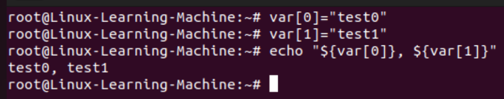  

變數除了可以直接設定修改外，也可以進行一些微調的動作，例如刪除, 取代和預設值等等  
先講變數的刪除  
```
${variable#pattern}   // 從前面開始找，刪除到最短符合pattern的位置 (從前面開始到第一個pattern位置)
${variable##pattern}  // 從前面開始找，刪除到最長符合pattern的位置 (從前面開始到最後一個pattern位置)
${variable%pattern}   // 從後面開始找，刪除到最短符合pattern的位置 (從後面開始到第一個pattern位置)
${variable%%pattern}  // 從後面開始找，刪除到最長符合pattern的位置 (從後面開始到最後一個pattern位置)
```
單看有一點難懂，這邊就用例子解釋  
我們先用path去複製PATH這個變數  
然後假設我們想刪除第一個/usr/local/sbin這個  
因此我們就從前面開始找且要找到第一個符合"/\*sbin:"的pattern (所以用#)
  
那如果變成##會發生什麼事  
他會找到最後一個符合"/\*sbin:"的pattern的位置並把前面全部刪除，所以只留下最後兩個  
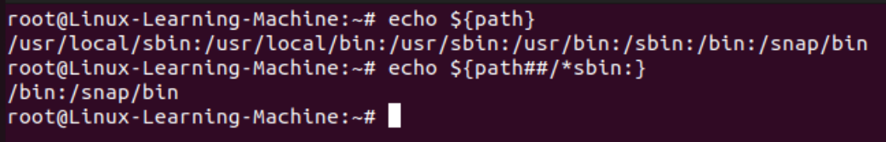  
%和%%也是一樣的道理，只是從後面開始找  

接著是取代  
```
${variable/old_pattern/new_pattern}   // 把第一個old_pattern替換成new_pattern
${variable//old_pattern/new_pattern}  // 把所有old_pattern替換成new_pattern
```
  
最後是預設值  
var1經常等於var2 (變數名稱相同)  
|        指令        | var2未設定 | var2為空字串 | var2有設定且不為空字串 |
| ------------------ | ---------- | ------------ | ---------------------- |
| var1=${var2-expr}  | var1=expr  | var1=        | var1=var2              |
| var1=${var2:-expr} | var1=expr  | var1=expr    | var1=var2              |
| var1=${var2+expr}  | var1=      | var1=expr    | var1=expr              |
| var1=${var2:+expr} | var1=      | var1=        | var1=expr              |
| var1=${var2=expr}  | var1=var2=expr | var1=var2= | var1=var2            |
| var1=${var2:=expr} | var1=var2=expr | var1=var2=expr | var1=var2        |
| var1=${var2?expr}  | 顯示expr   | var1=        | var1=expr              |
| var1=${var2:?expr} | 顯示expr   | 顯示expr     | var1=expr              |

來看幾個範例  
一開始沒設定username，所以echo什麼東西都沒有  
我們給它一個預設值root，所以第二次echo的時候就會顯示root  
當我們設定完username後，第三次echo就會顯示我們的設定值  
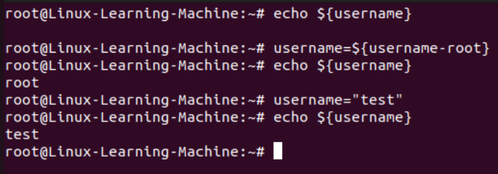  
如果我們把username設定成空字串，但在裡面加一個:  
系統還是會把它設定成預設值  
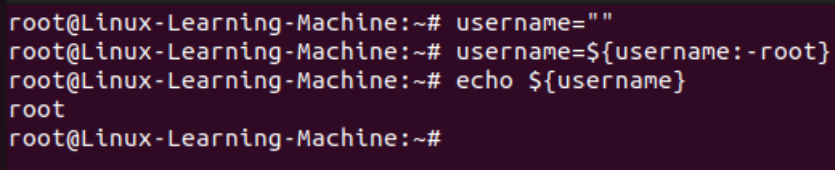  
接著測試一下如果為設定variable，則顯示error message  
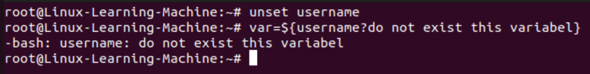  

## Shell設定限制使用者資源
若今天linux主機一次有好幾個人登入，且每個人都濫用資源，若系統不加以限制資源一定會讓系統當機  
因此shell是可以限制使用者的某些資源的，例如可開啟檔案數量, 可使用CPU時間, 可使用記憶總量等等  
就是要使用ulimit這個指令  
```
ulimit [options] 配額  
```
ulimit -a可以顯示出所有限制資料的數值  
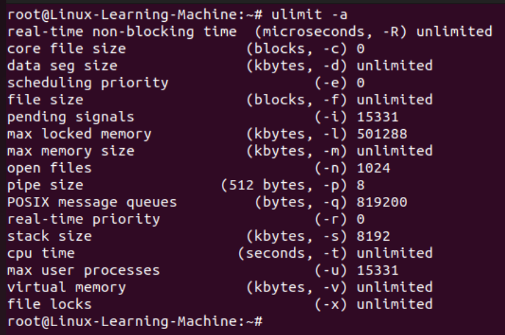  
接著測試讓使用者只能創建10M以下的檔案，然後嘗試創建20M的檔案  
會發現出現error  
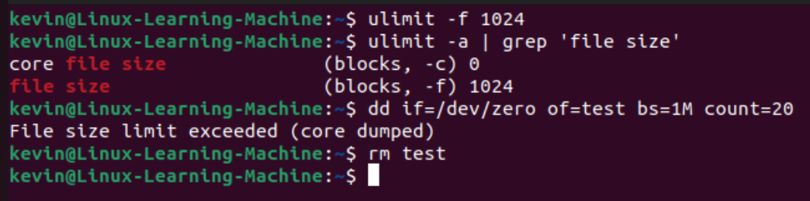  
\* 要恢復的話只要登出在登入即可  
\* ulimit沒有一定要root權限，但是如果是一般使用者的話，則只能減少容量不能增加  

## 別名  
別名是當有一些指令太長時，可以幫它取別名讓它變段，這個功能尤其在某些指令很常被使用時特別好用  
要使用別名就要用alias這個指令  
```
alias 別名=指令  
```
如果直接打alias的話會顯示目前已有的別名和指令  
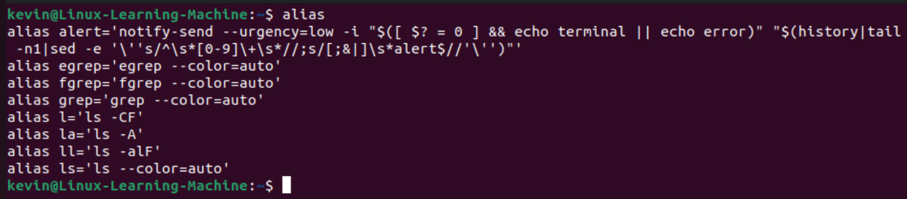  
這邊嘗試把"rm -i"這個指令取別名成rm  
這樣每次刪除檔案就都會詢問  
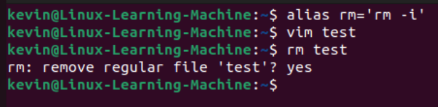  
今天若要把別名取消則可以用unalias這個指令  
```
unalias 別名
```
例如把剛剛的rm取消掉  
就會發現刪除檔案不會在詢問  
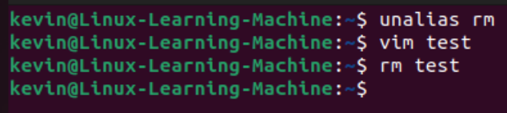  

## history
前面有說過shell有紀錄歷史的功能，我們可以透過history來查看和操作歷史的指令  
```
history 數字  // show出近n筆指令
history -c    // 刪除所有shell中history的內容  
history [options]
```
假設我們直接輸入history，則會顯示所有history內容  
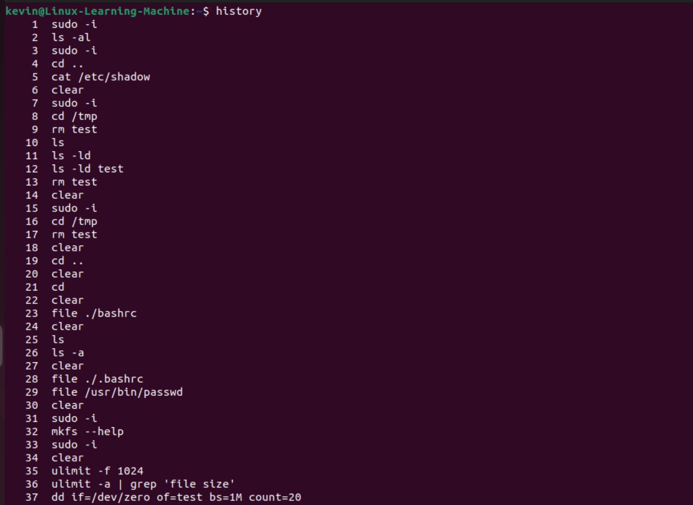  
若我們加入數字，則是顯示近n筆  
  
若用"history -w"則會把記憶體內存放的history指令寫入history file中，bash預設是.bash_history  
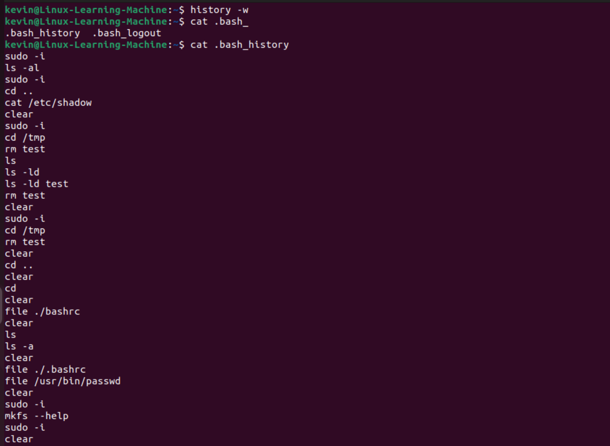  

通常一般linux對於history的處理是這樣的  
1. 登入linux後，linux會去讀取.bash_history檔案來讓使用者可以使用上次登錄的指令，會有幾筆跟設定HISTFILESIZE變數有關  
2. 登出時，linux會將記憶體內的指令寫進.bash_history內 (最多1000筆)  

如果有user用同一個帳號，開了好幾個bash，那最後登出的那個bash會把前面登出的bash的歷史紀錄覆蓋掉  

## bash環境
### 指令執行順序  
在linux中可能會有好幾個相同的指令，因此bash在執行的時候是有順序優先的  
順序如下:  
1. 直接以相對路徑或絕對路徑去執行，例如直接下"/bin/ls" (有直接指定)  
2. 由alias找到該指令執行  
3. bash內建  
4. 透過$PATH這個變數的路徑搜尋到的第一個符合條件的執行  

例如echo會先使用bash內建才去使用$PATH內的  
  

### bash進站畫面
bash進站畫面是寫在"/etc/issue"這個檔案內，如下  
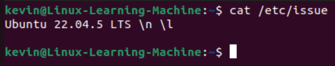  
而在tty內登如實可以看到以下資訊  
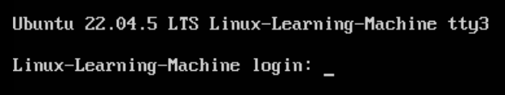  
也可以透過修改issue這個檔案來改變進站畫面  
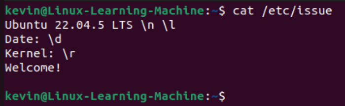  
進站畫面則會變成  
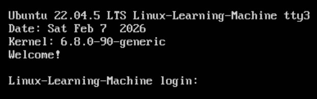  

\* "/etc/issue"這個檔案只能用root來修改  
另外還有一個/etc/issue.net這個檔案，他是給telnet登入看的 (有點像ssh)  

### bash登入後訊息
Ubuntu的登入後訊息是透過讀去"/etc/update-modt.d"這個資料夾下的script來形成的  
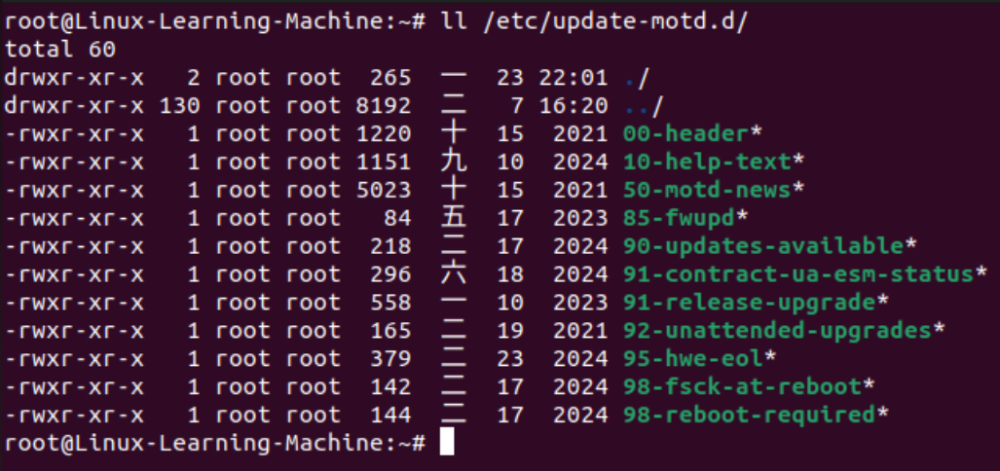  
畫面如下  
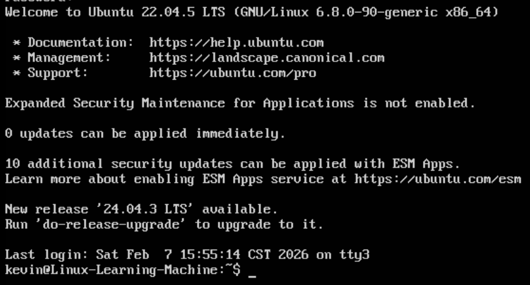  
我們也可以修改此訊息，當我要把我不想要的訊息拿掉，就把他的執行權利拿掉  
```
chmod -x filename
```
例如說我這邊只保留了header，其餘的都拿掉  
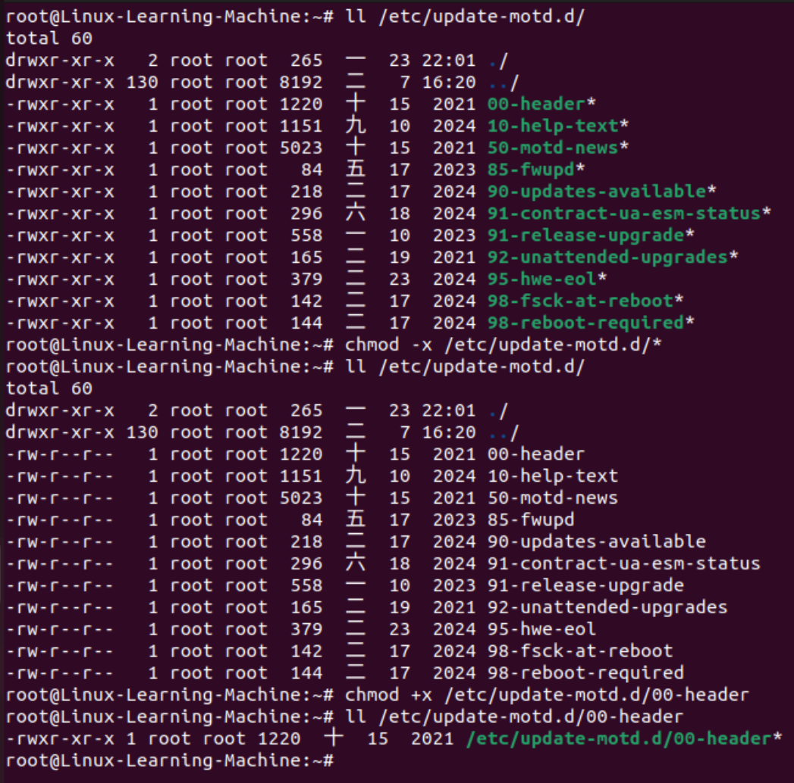  
可以看到tty只保留了header  
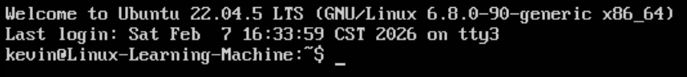  
當然也可以自己寫script來加入message，寫完記得要加入執行權限  
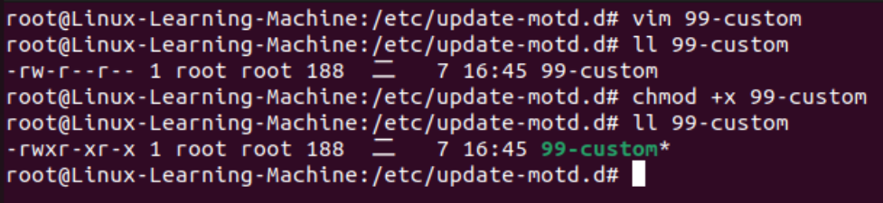  
再次登入即可看到  
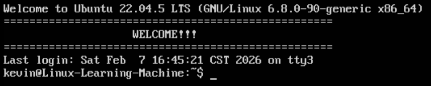  

### bash環境設定
linux內有一些環境設定檔的存在，所以當bash啟動時，就會讀取這些設定  
#### login shell vs non-login shell
重點就在於有沒有login  
1. login shell  
   像是在tty會要求使用者進行登如，這個啟動的bash就是login shell  
2. non-login shell  
   像是在X window登入後，後續我們啟動的terminal都不需要再次登入，這時的bash就是non-login shell  

有一些檔案是只有login shell才會讀取，像是"/etc/profile"或是"~/.profile"  
而像是"~/.bashrc"則是兩者都會讀取  

這些設定檔都是可以被修改的，修改完後可以透過"source"這個指令來更新  
```
source 設定檔
```

#### 終端機的環境設定
在前面我們有說過可以透過ctrl + c終止指令或是ctrl + d來離開，這些都是終端機的設定  
那我們可以透過"stty"來查閱內容  
```
stty -a
```
這會顯示出所有按鍵組合內容  
當然也可以修該刪除，但是通成不會去改設定，因為決大多數都會去使用原本的設定  

## 資料流
資料流就是整套資料處理的過程 
例如說我們執行一個指令，會先去讀取這個檔案，經過處理顯示在螢幕上  

資料流重導向就是將standard output和standard error output分別傳送到不同的檔案和裝置  
\* 簡單的說standard output就是指令執行回傳的正確結果，而standard  error output則是error mesage  
\* standard input則是輸入，意思是把原先鍵盤輸入別成將某個檔案內容做輸入  

而要做資料流導向則是使用以下特殊符號  
1. standard input (stdin):  use < or <<  
2. standard output (stdout): use > or >> or 1> or 1>>  
3. standard error (stderr): use 2> or 2>>  

例如把輸出結果導向到檔案內  
可以看到"ll .bash\*"被寫到test這個檔案而沒有顯示到螢幕  
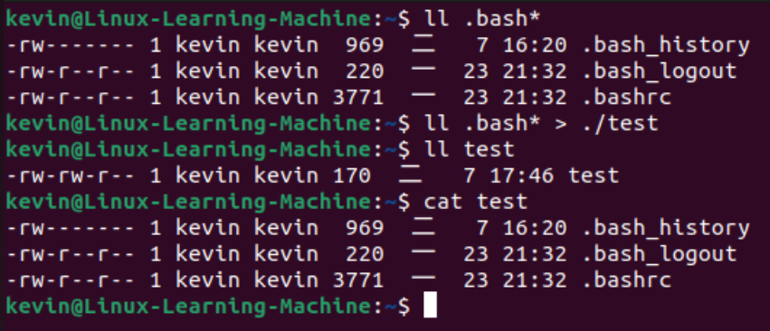  

那">"和">>"有什麼差別呢，就是">"是覆蓋，而">>"是續寫  

如果今天我不想要看到error message，則會需要使用"/dev/null" (黑洞裝置)  
"/dev/null"可以吃掉任何導向此裝置的資料  

例如今天我用user去安裝一個軟體，通常會顯示error (權限不足)  
但如果我把資料導向"/dev/null"則不會顯示東西  
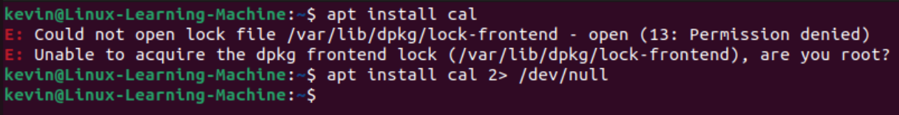  

## Shell script
shell script直翻是程式腳本，簡單的說就是用shell的功能去寫一個program  
這個program是個純文字檔，裡面都是shell的語法和指令  
而且shell script有提供迴圈, 條件, 邏輯判斷等等 

在寫shell script第一件事是要在第一行加入  
```
#!/bin/bash
```
來讓linux知道這是bash的語法  

### 執行shell script的方式  
執行shell script有三種方式，分別是sh, 直接執行路徑和source  
\* sh是POSIX的標準shell，而bash是功能和語法更完整的shell，下面的某些語法用sh執行會錯誤，需要bash執行  

若用sh或者直接執行路徑linux會創建出child bash，因此在child process的變數或回傳值不會傳回到parent  
例如這邊寫一個簡單的shell script
```
#!/bin/bash

var=1234
echo ${var}
```
當我們用執行完後在bash執行"echo ${var}"會發現沒有東西，因為child process變數並未回傳到parent  
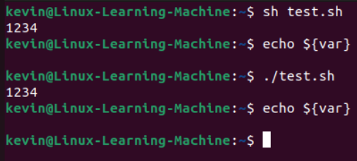  
但當我們用source執行時，它會是以現在的bash來去執行，因此在bash執行"echo ${var}"是會有東西的  
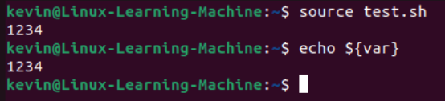  

### shell script預設變數  
有的時候，我們會在執行script時，在後面順便帶一些參數，shell script會把後面的參數設成預設變數  
在script裡面我們就能應用這些預設變數  
```
scriptname opt1 opt2 opt3 opt4 ...   // 執行script時輸入的command和parameters
    $0      $1   $2   $3   $4        // script預設參數
```
所以如果我們要在script利用到這個scipt的檔名，就可以直接利用${0}這個變數，要用opt1就可以用${1} ...  
除了這些預設變數外，還有一些其他script預設變數  
1. $#  
   代表著後面有幾個參數  
2. "$@"  
   代表所有的參數，以雙引號隔開  
3. "$\*"  
   把所有參數合成一個字串  
4. $@和$\*  
   這兩者幾乎一樣，會以空白隔開  

例如寫一個簡單的script  
```
#!/bin/bash

echo "The script name: ${0}"
echo "Total paramters number: ${#}"

echo "-----\$@-----"
for arg in ${@};
do
	echo "[${arg}]"
done

echo "-----\"\$@\"-----"
for arg in "${@}";
do
	echo "[${arg}]"
done

echo "-----\$*-----"
for arg in ${*};
do
	echo "[${arg}]"
done

echo "-----\"\$*\"-----"
for arg in "${*}";
do
	echo "[${arg}]"
done

echo "First paramter: ${1}"
echo "Second paramter: ${2}"
```
這時我們下以下指令  
```
sh show_parameters.sh 123 "1234 12345" 123456
```
就會得到以下結果  
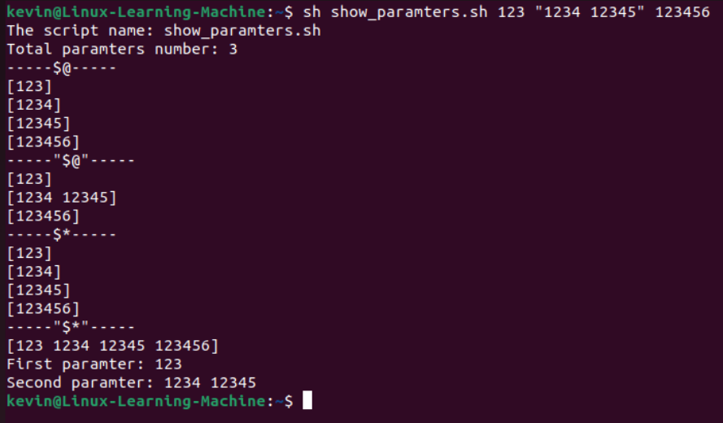  

script還可以"shift"這個指令對這些預設的變數進行shift  
```
shift num
// 若不給num這是shift一個，若有num則是shift num個
```
就是把原本的${1}刪掉，讓原本的${2}變成新的${1}，原本的${3}變成新的${2}，依此類推  
直接看範例  
```
#!/bin/bash

echo "Total paramters number: ${#}"
echo "First paramter: ${1}"
echo "Second paramter: ${2}"

echo "------ Shift ------"
shift
echo "Total paramters number: ${#}"
echo "First paramter: ${1}"
echo "Second paramter: ${2}"
```
執行script  
```
sh shift_parameters.sh 1 2 3 4 5
```
會得到以下結果  
  

### 判斷式
#### test 和 []
test是一個指令，它的功能和if差不多，可以判斷一些檔案之類的相關屬性  
例如判斷路徑是否存在  
```
test -e /path
```
而"[]"和test是一模一樣的東西，"[]"是test的語法糖，兩者完全一樣  
\*這邊要注意，如果要注意，如果要使用"[]"要保留空格，且變數或是路徑等都加上雙引號  

這邊看一下test和"[]"的範例  
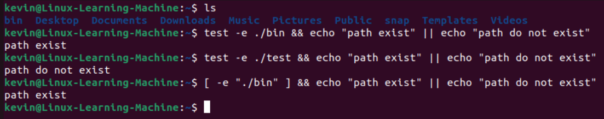  

#### [[]]
"[[]]"和"[]"基本上概念是一樣的，都是在裡面寫判斷式，但"[[]]"是bash的keyword，並不是指令  
而且"[[]]]"支援regular expression，但它不能被sh執行  

#### if ... then
在上面那個test的圖片，我們用"&&"和"||"來去作到判斷路徑是否存在並echo出對應結果  
但其實是可以用大家寫一般的program language常用的if來寫  
基本語法如下 ("[]"也可以用"[[]]"代替，看個人需求)  
\* 另外script是可以只有if的，不一定要以else結尾    
```
if [判斷式]; then
	program
elif [判斷式]; then
	prgoram
else
	program
fi
```
這邊寫一個簡單的script先判斷"test"目錄是否存在在判斷"test2"目錄是否存在並輸出對應結果  
```
#!/bin/bash

if [ -d "./test" ]; then
	echo "Dir test exist!"
elif [ -d "./test2" ]; then
	echo "Dir test2 exist!"
else
	"Neither of each exist!"
fi
```
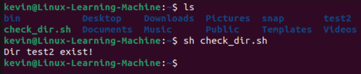  

#### case
有寫過c++或c等等的program language都應該知道if else if可以用case來作到相似功能，script也有case  
基本語法如下 (最後經常用\*來接收所有不在case的結果)  
```
case ${var} in
	"case1")
		program
		;;
	"case2")
		program
		;;
	*)
		program
		;;
esac
```
這邊也寫一個簡單的script  
```
#!/bin/bash

case ${1} in
	"hello")
		echo "Hello!"
		;;
	"")
		echo "Need input parameter"
		;;
	*)
		echo "Usage ${0} {hello}"
		;;
esac
```
執行結果如下  
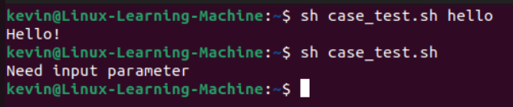  

### function
跟我們認知的program language function概念一樣  
這邊要注意在POSIX標準shell中，語法如下  
```
function fname(){
	program
}
```
但在bash中，不會有function  
```
fname(){
	program
}
```
這邊function輸入參數和回傳基本上和script的概念一樣  
輸入參數方法如下  
```
fname(){
	echo ${1}
	echo ${2}
	...
}

fname opt1 opt2 ...
```
回傳參數有兩種方法  
1. 回傳數值且數值介於0~255  
   ```
   fname(){
	   return num
   }
   
   fname
   echo ${?}
   ```
2. 把function當指令執行  
   ```
   fname(){
	   echo "Hello"
   }
   
   res=$(fname)
   echo ${res}
   ```
若不想讓function內的變數污染外部可以用local  
```
fname(){
	local name=${1}
	echo "Hello ${name}
}
```
這邊也寫一個簡單的script來當範例  
```
#!/bin/bash

testFunc(){
	echo ${1}
}

testFunc "Hello"
```
執行結果如下  
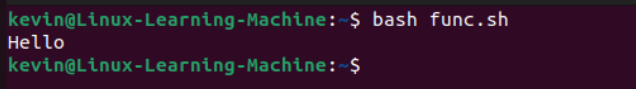  

### loop
#### while, until
while是如果判斷式成立就會一直執行下去
基本語法  
```
while [判斷式]
do
	program
done
```
until和while剛好相反，若判斷式成立則停止  
基本語法和while差不多
```
until [判斷式]
do
	program
done
```
這邊也寫個script，此script要使用者輸入"yes" or "YES"才會結束  
\* 這邊的"-a"是and的意思，而or是"-o" (像是c++的&&和||)  
```
#!/bin/bash

while [ "${yn}" != "yes" -a "${yn}" != "YES" ]
do
	read -p "Please input yes/YES to stop process: " yn
done

echo "Finish process!"
```
執行結果  
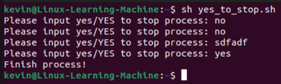  

#### for
基本語法如下 (有兩種)  
```
// 讓var依序變成var1, var2, var3, ...
for var in var1 var2 var3 ...
do
	program
done

// 像c++ (initial; end condition; execute step)
for ((init; end; exec))
do
	program
done
```
這邊也寫個簡單script  
```
#!/bin/bash

varArr[0]="000"
varArr[1]="111"
varArr[2]="222"
varArr[3]="333"

for (( i=0; i<=3; i=i+1 ))
do
	echo ${varArr[${i}]}
done
```
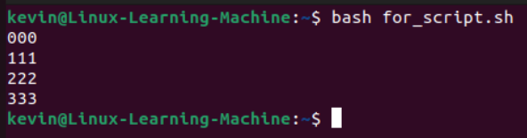  

### script的trace和debug
sh和bash都有內建的檢查選項，兩者用法相同  
```
sh [-nvx] script.sh
\\ -n: 僅檢查語法，但不執行script
\\ -v: 執行script前將script內容輸出到螢幕上
\\ -x: 一邊執行，一邊將用到的內容輸出到螢幕上
```
各種執行如下  
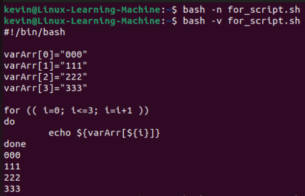  
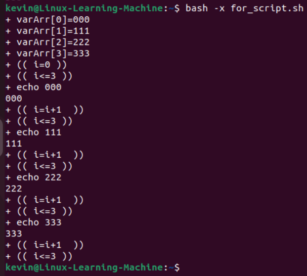  
